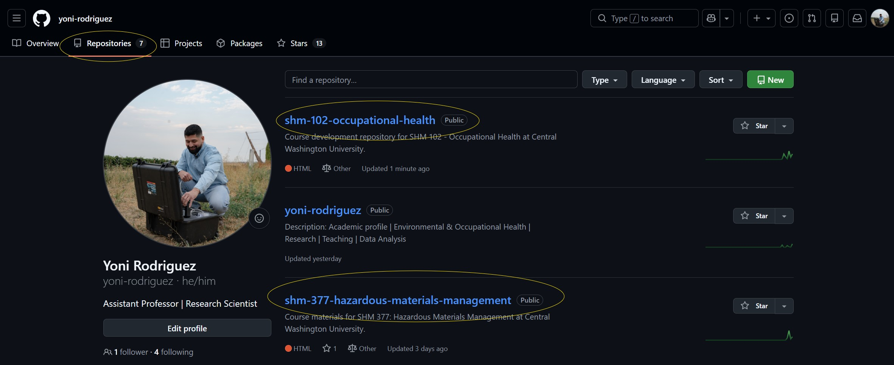
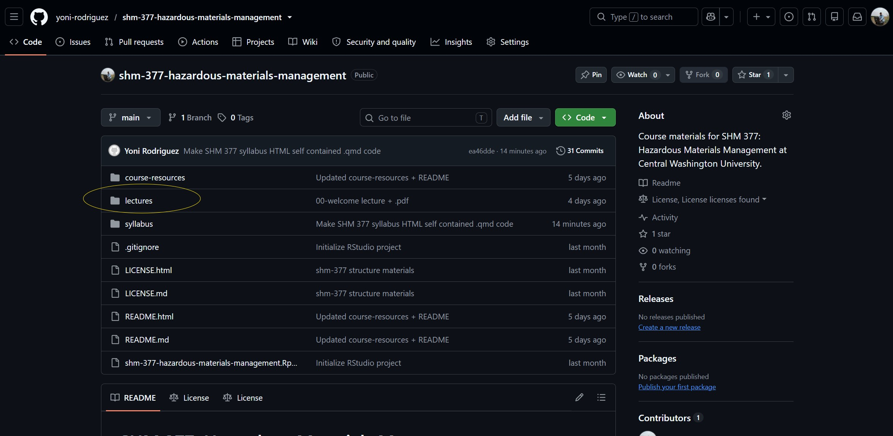
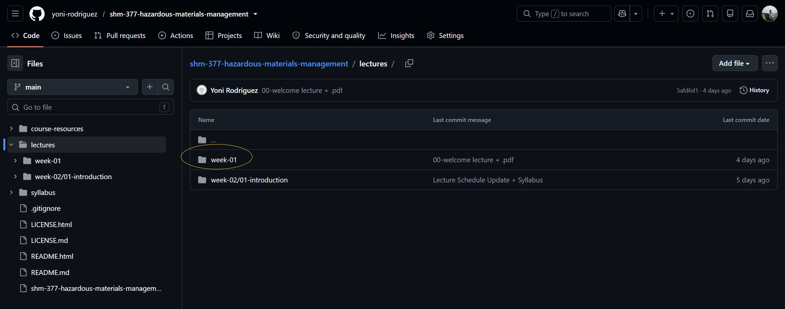
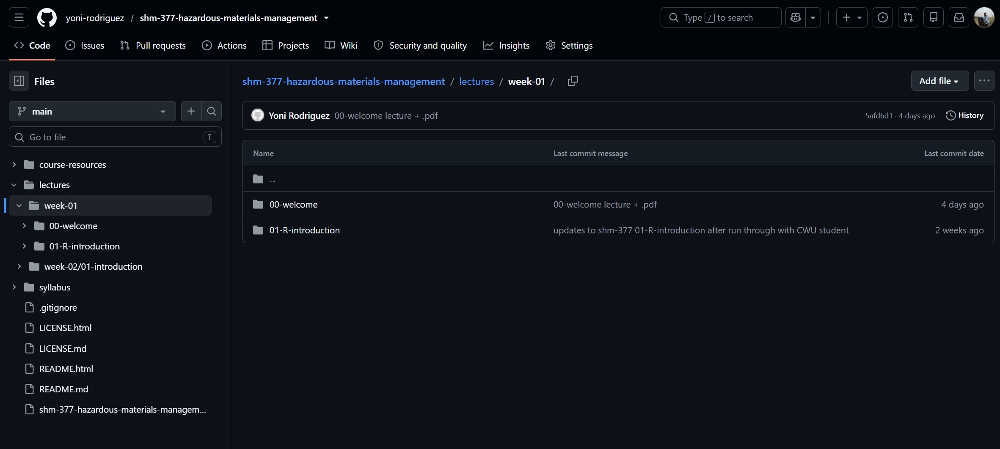
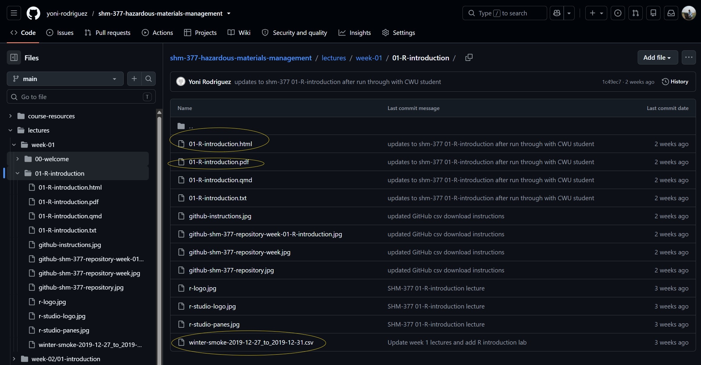
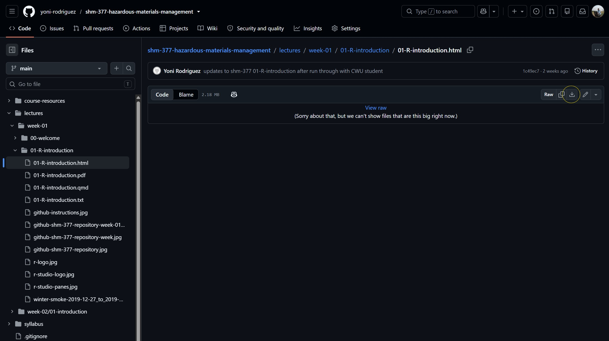
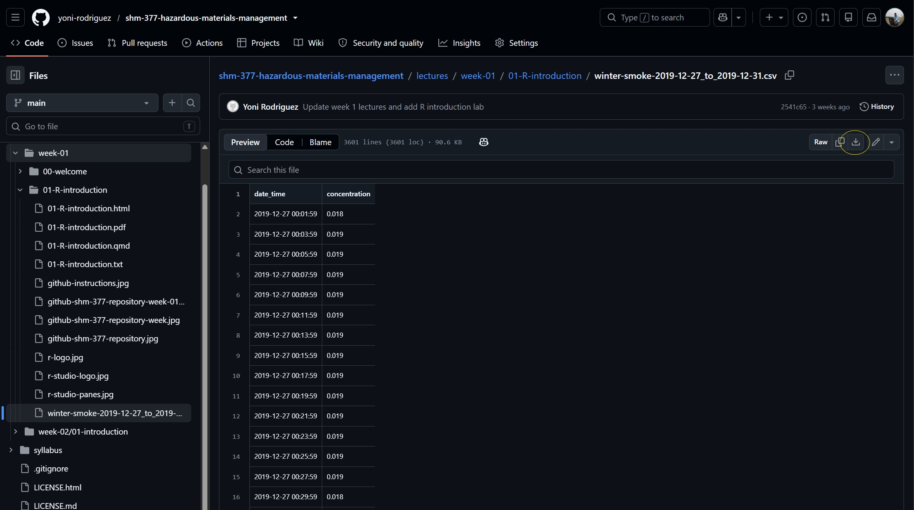
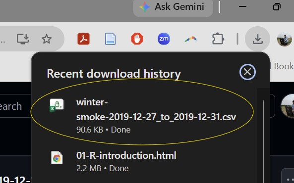

# Using GitHub for SHM 377

We will use GitHub throughout SHM 377 to access **lecture materials, datasets, and other course resources**.

GitHub contains several different file types, including the source files used to build the course materials. **You do not need to understand or interact with the source code to use the repository.**

::: {.callout-note title="What You Will Learn"}
By the end of this guide, you should be able to:

1. Find the SHM 377 GitHub repository.
2. Navigate to the correct week and lecture.
3. Download an HTML lecture.
4. Download a CSV dataset.
5. Move the CSV dataset into your SHM 377 course folder.
6. Find the dataset using the RStudio Files pane.
:::

::: {.callout-tip title="Start Here"}
Open my GitHub profile:

[**Yoni Rodriguez | GitHub**](https://github.com/yoni-rodriguez){.btn .btn-primary}

You may want to keep GitHub open in a separate browser tab while following this guide.
:::

# Step 1: Go to My GitHub Profile

Go to my GitHub profile:

<https://github.com/yoni-rodriguez>

Once you are on my profile, select **Repositories**.

{fig-alt="GitHub profile showing the Repositories tab and the SHM 377 repository." width=95% fig-align="center"}

You will see the repositories containing my course materials.

For this course, select:

> **shm-377-hazardous-materials-management**

# Step 2: Open the Lectures Folder

Inside the SHM 377 repository, select the **lectures** folder.

{fig-alt="SHM 377 GitHub repository showing the lectures folder." width=95% fig-align="center"}

This folder contains the lecture and lab materials that we will use throughout the quarter.

# Step 3: Select the Appropriate Week

The course materials are organized by week.

For example, for Week 1 select:

> **week-01**

{fig-alt="SHM 377 lectures folder showing the week-01 folder." width=95% fig-align="center"}

Within each week, individual lectures and activities are organized into their own folders.

# Step 4: Open the Appropriate Lecture Folder

For our R introduction, select:

> **01-R-introduction**

{fig-alt="SHM 377 Week 1 folder showing the R introduction folder." width=95% fig-align="center"}

Inside the folder, you will see several files associated with the lecture and lab.

{fig-alt="Files available inside the SHM 377 R introduction folder on GitHub." width=95% fig-align="center"}

## Which Files Do I Need?

For students, the most important file types are:

| File Type | What It Is | What You Will Use It For |
|:---|:---|:---|
| **`.html`** | Interactive course material | Viewing lectures and labs in your web browser |
| **`.pdf`** | PDF course material | Saving, printing, or reviewing course materials |
| **`.csv`** | Dataset | Importing data into R, Excel, or another analysis program |

::: {.callout-note title="What About the Other Files?"}
You may also see `.qmd`, `.txt`, image files, and other development files.

These files are primarily used to **create the course materials**. You do not need to understand or use them unless specifically instructed to do so.
:::

# Downloading an HTML Lecture

## Step 5: Select the HTML File

Select the `.html` version of the lecture.

For example:

```text
01-R-introduction.html
```

GitHub may tell you that it cannot display the HTML file directly because the file is too large.

**That is okay.**

Select the **download icon** in the upper right corner.

{fig-alt="GitHub HTML file page showing the download icon." width=95% fig-align="center"}

Your browser will download the HTML file to your computer.

Once the file has downloaded, open it from your browser's downloads or your computer's **Downloads** folder.

The HTML file should open in your web browser and display as the complete lecture rather than as source code.

::: {.callout-tip title="HTML Files Open in Your Browser"}
An `.html` file is a webpage saved as a file on your computer.

When you open the downloaded file, your web browser should display the formatted lecture just like a webpage.
:::

# Downloading a CSV Dataset

Datasets require one additional step because RStudio needs to know **where the file is located on your computer**.

## Step 6: Select the CSV File

For our R introduction, the dataset is:

```text
winter-smoke-2019-12-27_to_2019-12-31.csv
```

Select the CSV file in GitHub.

GitHub will display a preview of the dataset. You do **not** need to copy the data from this screen.

Instead, select the **download icon** in the upper right corner.

{fig-alt="GitHub CSV dataset preview showing the download icon." width=95% fig-align="center"}

The CSV file will download through your browser.

You should then see the downloaded file in your browser's download history.

{fig-alt="Browser download history showing the downloaded SHM 377 CSV dataset and HTML lecture." width=70% fig-align="center"}

# Moving the CSV File into Your SHM 377 Folder

::: {.callout-important title="This Step Is Important"}
Downloading the dataset does **not** automatically place it inside your SHM 377 RStudio Project.

Your browser will normally place downloaded files in your computer's **Downloads** folder.

You need to move the dataset into the folder you created for SHM 377.
:::

## Step 7: Find the Downloaded CSV File

Open your computer's **Downloads** folder and locate:

```text
winter-smoke-2019-12-27_to_2019-12-31.csv
```

Do not open the CSV file in Excel yet.

Instead, **move or copy the CSV file into the SHM 377 folder that you created for this course**.

For example, your folder might look something like:

```text
SHM-377/
└── virtual-lab-01/
    ├── winter-smoke-2019-12-27_to_2019-12-31.csv
    └── your-R-script.R
```

The exact folder structure may vary depending on how you organized your course folder.

The important part is that **you know where the CSV file is stored and that it is inside the folder you are using for your RStudio work.**

# Finding the Dataset in RStudio

## Step 8: Open Your SHM 377 RStudio Project

Open the RStudio Project that you created for SHM 377.

Look at the **Files pane** in RStudio.

The Files pane shows the files and folders contained in your current project location.

Navigate to the folder where you placed the CSV file.

You should see:

```text
winter-smoke-2019-12-27_to_2019-12-31.csv
```

::: {.callout-tip title="A Quick Check"}
If you can see the CSV file in the RStudio **Files pane**, you have successfully placed the dataset where RStudio can find it.
:::

You can confirm your current working directory by running:

```{r}
# Check the current working directory
getwd()
```

You can also see the files available in your current folder by running:

```{r}
# List the files in the current working directory
list.files()
```

If the CSV filename appears when you run `list.files()`, you are in the correct location.

# The SHM 377 Workflow

One of the goals of SHM 377 is learning how to work with real environmental and occupational health data.

Our basic workflow will be:

```text
GitHub
   ↓
Download dataset
   ↓
Move dataset into your SHM 377 folder
   ↓
Open your RStudio Project
   ↓
Locate the dataset in the Files pane
   ↓
Import and analyze the data
```

Keeping your files organized now will make the later labs much easier.

# Quick Reference

| File | What Should I Do With It? |
|:---|:---|
| **HTML** | Download it and open it in your web browser |
| **PDF** | Download it for viewing, saving, or printing |
| **CSV** | Download it and move it into your SHM 377 working folder |
| **QMD** | You generally do not need this file |
| **TXT** | You generally do not need this file |

::: {.callout-important title="Remember"}
You **do not need to learn GitHub programming or Git commands for this course.**

For SHM 377, GitHub is primarily where you will access **course materials and datasets**.

For datasets, remember:

**Download → Move to your SHM 377 folder → Find it in RStudio → Analyze**
:::

# Need Help?

If you have trouble finding or downloading a file after following these steps, please let me know.

**Yoni Rodriguez**  
Assistant Professor  
Central Washington University

---

::: {.text-center}
© 2026 Yoni Rodriguez. All rights reserved.

SHM 377: Hazardous Materials Management  
Central Washington University
:::

