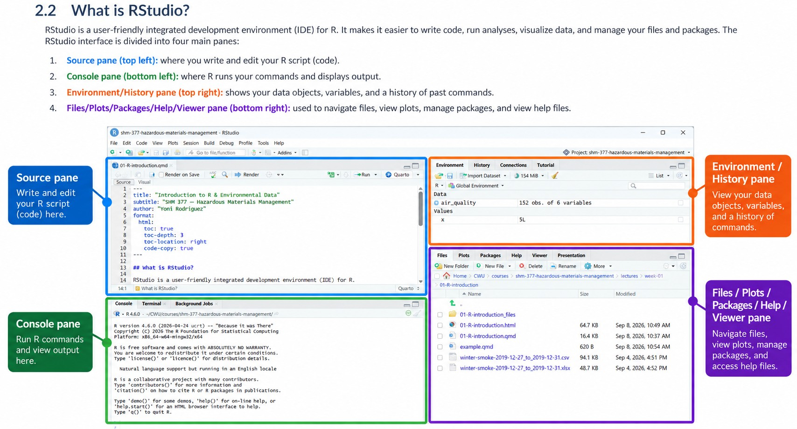
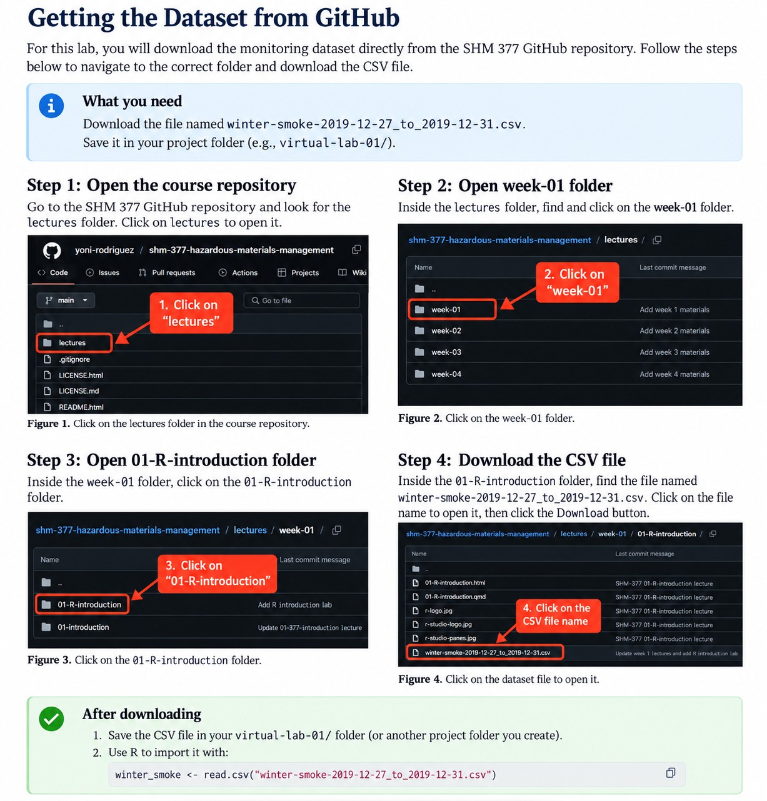

```{=html}
<style>

/* =========================================================
   Lecture Styling
   ========================================================= */

/* ---------------------------------------------------------
   Typography
   Keep lecture text consistent throughout the document
   --------------------------------------------------------- */

body {
  color: #212529;
}

blockquote {
  color: #212529;
  font-size: inherit;
  font-style: normal;
  font-weight: normal;
}

blockquote strong {
  color: #212529;
}

.text-center {
  color: #212529;
}


/* =========================================================
   Responsive Mobile Layout
   Stack ALL Quarto columns on narrow screens
   ========================================================= */

@media (max-width: 768px) {

  /* Convert every Quarto column group to a vertical layout */
  .columns {
    display: block !important;
  }

  /* Every content column becomes full width */
  .columns > .column {
    width: 100% !important;
    max-width: 100% !important;
    flex: 0 0 100% !important;
  }

  /* Remove empty spacer columns used in desktop layouts */
  .columns > .column:empty {
    display: none !important;
  }

  /* Keep images within the phone viewport */
  img {
    max-width: 100%;
    height: auto;
  }

  /* Prevent long text or captions from forcing page width */
  p,
  li,
  figcaption {
    overflow-wrap: anywhere;
  }

}

</style>
```

# Virtual Lab 01

## Introduction to R & Environmental Data

Today we will use a real environmental monitoring dataset to answer a simple question:

> **What happened to ambient particle concentrations during five days of winter monitoring?**

We will use R to:

- obtain the data
- inspect the data
- check the measurements
- calculate simple summaries
- create a visualization
- interpret what we see

The goal is not to become a programmer today.

The goal is to begin using R as a tool for environmental and hazardous materials data analysis.

# The Monitoring Question

We have repeated measurements of airborne particles collected during winter monitoring.

The measurements were collected approximately every two minutes from:

**December 27 through December 31, 2019**

Our question is:

> **What happened to ambient particle concentrations during these five days?**

Before doing any analysis, we need to understand what the dataset contains.

# The Dataset

The teaching dataset contains approximately 3,600 observations.

It contains two variables:

| Variable        | Meaning                            |
|-----------------|------------------------------------|
| `date_time`     | When the measurement was collected |
| `concentration` | Measured particle concentration    |

The measurements were collected using a **TSI DustTrak**.

Particle concentration was measured in **milligrams per cubic meter (mg/m³)**.

The monitoring instrument measured particle concentration.

It did not identify the exact source of every particle.

This distinction is important.

> **Measurement does not equal source attribution.**

If concentration increases, we can observe the increase.

We cannot automatically conclude what caused it.

# Why Are We Using R?

Environmental and hazardous materials work often produces large amounts of data.

Examples include:

- air monitoring
- water sampling
- soil sampling
- surface sampling
- direct reading instrument data
- meteorological measurements
- exposure measurements

R gives us a way to organize, inspect, analyze, visualize, and communicate those data.

Another major advantage is reproducibility.

Instead of clicking through a series of menus and trying to remember what we did, we can save the commands used for the analysis.

# R and RStudio

We will use two pieces of software in this course: **R** and **RStudio**.

They work together, but they are not the same thing.

> **R is the program that performs the analysis. RStudio is the interface we use to work with R.**

Both are available for free.

## What is R?

{fig-alt="R statistical computing software logo." width="180px"}

**R** is a programming language and analytical environment used for:

- data analysis
- statistics
- visualization
- reproducible research

When we ask R to calculate a mean, summarize a dataset, or create a graph, **R is the software actually performing those operations**.

R is free software and is available for Windows, macOS, and Linux.

[Download R from the R Project](https://www.r-project.org/)

## What is RStudio?

{fig-alt="RStudio integrated development environment logo." width="180px"}

**RStudio** is an integrated development environment, or IDE, that provides a convenient interface for working with R.

Instead of working with R through a basic command window, RStudio gives us an organized workspace where we can:

- write and save code
- run R commands
- view our data
- create and view graphs
- navigate files
- access help and documentation

RStudio Desktop is available in a free open source edition.

[Download RStudio Desktop from Posit](https://posit.co/downloads/)

# Installing R and RStudio

Before we begin working with data, we need both **R** and **RStudio Desktop** installed on your computer.

Both are free.

::: callout-important
## Installation order matters

Install the software in this order:

1.  **Install R**
2.  **Install RStudio Desktop**
3.  **Open RStudio**
4.  **Confirm that RStudio can find and run R**

RStudio provides the interface, but R performs the computations.
:::

## Windows

1.  Go to the [R Project](https://www.r-project.org/).
2.  Select **CRAN**.
3.  Choose a CRAN mirror.
4.  Select **Download R for Windows**.
5.  Download the current version of R.
6.  Run the installer and follow the installation prompts.
7.  Go to the [RStudio Desktop download page](https://posit.co/downloads/).
8.  Download the free version of RStudio Desktop for Windows.
9.  Run the RStudio installer.
10. Open RStudio.

## macOS

The installation process on macOS depends on your version of macOS and your Mac's processor.

1.  Go to the [R Project](https://www.r-project.org/).
2.  Select **CRAN**.
3.  Choose a CRAN mirror.
4.  Select **Download R for macOS**.
5.  Read the available installer descriptions carefully.
6.  Download the version appropriate for your Mac.
7.  Install R.
8.  Go to the [RStudio Desktop download page](https://posit.co/downloads/).
9.  Download the free version of RStudio Desktop for macOS.
10. Install RStudio.
11. Open RStudio.

::: callout-warning
## macOS users

Do not guess which installer you need.

Different Mac computers may use different processors. We will verify your Mac and select the appropriate installer before continuing if you are unsure.
:::

## Check Your Installation

Once RStudio opens, locate the **Console** pane.

You should see information about the version of R that is running followed by the `>` prompt.

At the prompt, enter:

```{r}
#| eval: false

2 + 2
```

If R returns:

``` text
[1] 4
```

R and RStudio are communicating correctly.

::: callout-tip
## Need more help?

If you have trouble installing R or RStudio, use the official installation resources:

- [R Project](https://www.r-project.org/)
- [RStudio Desktop Download](https://posit.co/downloads/)
- [RStudio Desktop Installation Documentation](https://docs.posit.co/ide/desktop-pro/getting_started/installation.html)

If you are unsure which version to install, especially on macOS, ask for help before continuing.
:::

## The RStudio Interface

You will commonly see four areas in RStudio:

::: column-screen-inset
{fig-alt="RStudio interface showing the Source, Console, Environment and History, and Files, Plots, Packages, Help, and Viewer panes."}
:::

One important habit for this course is:

> **Write your commands in the Source pane rather than relying only on the Console.**

The Source pane allows us to save our code and creates a record of what we did.

# Organizing Your Work

Before downloading our dataset, we need to decide where our files will live.

Good file organization makes working with data much easier. Many problems in R happen because files are saved in different locations and R cannot find them.

For this course, we will keep files associated with the same project together.

## Create a Course Folder

Create a folder on your computer called:

``` text
SHM-377
```

Inside that folder, create a folder for today's lab:

``` text
SHM-377/
└── virtual-lab-01/
```

We will save everything for today's analysis inside `virtual-lab-01`.

By the end of the lab, your folder may look something like this:

``` text
SHM-377/
└── virtual-lab-01/
    ├── winter-smoke-2019-12-27_to_2019-12-31.csv
    └── virtual-lab-01.R
```

::: callout-important
## Keep your project files together

Do not save the dataset in one location, your R script somewhere else, and your other project files in another folder.

Keeping related files together makes your analysis easier to reproduce and reduces problems caused by missing files or incorrect file paths.
:::

## File Naming

Use file names that tell you what the file contains.

Good:

``` text
winter-smoke-2019-12-27_to_2019-12-31.csv
virtual-lab-01.R
```

Avoid names such as:

``` text
data.csv
data-final.csv
data-final-2.csv
stuff.csv
```

Clear file names become increasingly important as projects grow.

::: callout-tip
## A simple rule for this course

**One project, one folder.**

Keep the data, code, figures, and other files associated with an analysis together.
:::

# Creating Your First R Script

Now we need a place to write and save our R commands.

We will use an **R script**.

An R script is a text file that contains R commands. Instead of typing commands only into the Console and losing track of what we did, we can save our commands in a script and use them again later.

## Open a New R Script

In RStudio:

1.  Select **File**.
2.  Select **New File**.
3.  Select **R Script**.

A new blank file will open in the Source pane.

This is where we will write our R commands.

## Save Your R Script

Before writing more code, save the file.

1.  Select **File**.
2.  Select **Save As**.
3.  Navigate to your `SHM-377` folder.
4.  Open the `virtual-lab-01` folder.
5.  Save the file as:

``` text
virtual-lab-01.R
```

The `.R` file extension tells your computer that this is an R script.

Your folder should now look like this:

``` text
SHM-377/
└── virtual-lab-01/
    └── virtual-lab-01.R
```

::: callout-important
## Write your commands in the script

For this course, write your R commands in the R script in the Source pane.

The Console shows what R is doing, but the script provides a saved record of the commands you used.
:::

## Set the Working Directory

R also needs to know where to look for the files used in our analysis.

Because we saved our R script inside `virtual-lab-01`, we can tell R to use that folder as the working directory.

In RStudio:

1.  Select **Session**.
2.  Select **Set Working Directory**.
3.  Select **To Source File Location**.

This tells R to look for files in the same folder where the R script is saved.

::: callout-tip
## Why does this matter?

Later, we will ask R to open the dataset using only its file name:

``` r
"winter-smoke-2019-12-27_to_2019-12-31.csv"
```

R needs to know which folder to search.

Setting the working directory to the source file location tells R to begin searching inside `virtual-lab-01`.
:::

# Your First R Commands

Now that R and RStudio are installed and communicating, we can begin working in R.

We will start very simply.

A **command** is an instruction we give R.

For example:

```{r}
2 + 2
```

This command asks R to perform a calculation.

R receives the instruction and returns the result underneath the code.

Try another:

```{r}
10 / 2
```

At its most basic level, working with R means:

> We give R an instruction and R returns something.

# Creating an Object

We can also store information in R.

```{r}
x <- 5
```

Now ask R what is stored in `x`.

```{r}
x
```

The symbol:

``` text
<-
```

is called the assignment operator.

You can read this:

``` r
x <- 5
```

as:

> Store the value 5 in an object called `x`.

We will use this idea constantly when working with datasets.

# Getting the Dataset

Now that we have a place for our work, we need the dataset we will analyze.

For this lab, we will use:

`winter-smoke-2019-12-27_to_2019-12-31.csv`

The dataset contains ambient particle measurements collected from December 27 through December 31, 2019.

## Download the Dataset

The dataset is available in the SHM 377 GitHub repository.

Use the guide below to navigate to the dataset and download the CSV file.

{fig-alt="Step-by-step instructions showing how to navigate the SHM 377 GitHub repository to locate and download the winter smoke CSV dataset." width="100%"}

Follow the steps shown above:

1. Open the SHM 377 GitHub repository.
2. Open the `lectures` folder.
3. Open the `week-01` folder.
4. Open the `01-R-introduction` folder.
5. Select `winter-smoke-2019-12-27_to_2019-12-31.csv`.
6. Download the CSV file.
7. Save the file inside your `virtual-lab-01` folder.

::: callout-important
## Make sure you download the CSV file

The file you need for this lab is:

`winter-smoke-2019-12-27_to_2019-12-31.csv`

Do not download the `.qmd`, `.html`, or `.pdf` file when you are trying to obtain the dataset.
:::

Your folder should now contain:

``` text
SHM-377/
└── virtual-lab-01/
    ├── virtual-lab-01.R
    └── winter-smoke-2019-12-27_to_2019-12-31.csv
```

::: callout-tip
## Check before continuing

Confirm that both `virtual-lab-01.R` and `winter-smoke-2019-12-27_to_2019-12-31.csv` are saved inside the same `virtual-lab-01` folder.

Keeping these files together will allow R to find the dataset when we import it in the next step.
:::

Now we are ready to bring the dataset into R.

# Importing the Dataset

We can use the `read.csv()` function to import the file.

**Function:** `read.csv()`

**Function name:** `read.csv`

**Purpose:** Import data from a CSV file.

A **function** is a tool in R that performs a particular task.

The name gives us a clue about what this function does.

`read.csv()` tells R to read a CSV file.

Enter this command in your R script:

```{r}
winter_smoke <- read.csv(
  "winter-smoke-2019-12-27_to_2019-12-31.csv"
)
```

Read that command from right to left.

R will:

1.  find the CSV file
2.  read the file
3.  create a dataset in R
4.  store the dataset under the name `winter_smoke`

The assignment operator `<-` is doing the same thing we saw earlier when we wrote:

``` r
x <- 5
```

This time, instead of storing the number `5`, we are storing an entire dataset.

We now have data inside R.

# Reading R Code

Before we continue, let's learn how to read some of the R code we will use.

## Commands and Functions

A **command** is an instruction we give R.

For example:

``` r
2 + 2
```

asks R to perform a calculation.

Many of the commands we use in R involve **functions**.

A function is a tool in R that performs a particular task.

For example:

``` r
head()
```

The function name is `head`.

The parentheses tell R that we want to use the function.

We can place information inside the parentheses to tell the function what we want it to work with.

For example:

``` r
head(winter_smoke)
```

This tells R:

> Use the `head()` function on the dataset called `winter_smoke`.

Throughout this course, when we introduce a new function, focus first on two questions:

1.  What is the function called?
2.  What does the function do?

You do not need to memorize every function.

## Referring to a Variable

Our dataset is called:

``` text
winter_smoke
```

One variable inside that dataset is called:

``` text
concentration
```

In R, we can refer to that variable using:

``` r
winter_smoke$concentration
```

The `$` tells R to look inside `winter_smoke` for the variable called `concentration`.

You can read:

``` r
winter_smoke$concentration
```

as:

> The `concentration` variable inside the `winter_smoke` dataset.

Later, when we write something such as:

``` r
mean(winter_smoke$concentration)
```

we can read it as:

> Use the `mean()` function on the `concentration` variable inside the `winter_smoke` dataset.

# Inspect Before You Analyze

One of the most important habits in this course will be:

> **Look at your data before analyzing it.**

We want to know:

- Did the file import correctly?
- What variables are present?
- How many observations are there?
- What does one row represent?
- Did R interpret the variables correctly?
- Do the values look reasonable?

# Look at the First Rows

The first function we will use to inspect our dataset is `head()`.

**Function:** `head()`

**Function name:** `head`

**Purpose:** Look at the first several rows of a dataset.

```{r}
head(winter_smoke)
```

This tells R to use the `head()` function on our `winter_smoke` dataset.

Look at the output.

Ask yourself:

> What does one row appear to represent?

# Look at the Last Rows

The `tail()` function allows us to look at the end of a dataset.

**Function:** `tail()`

**Function name:** `tail`

**Purpose:** Look at the last several rows of a dataset.

```{r}
tail(winter_smoke)
```

Looking at both the beginning and end of a dataset can help us confirm that the file contains the time period we expected.

# Variable Names

The `names()` function shows us the names of the variables in an object.

**Function:** `names()`

**Function name:** `names`

**Purpose:** Show the variable names in a dataset.

```{r}
names(winter_smoke)
```

We expect to see:

``` text
date_time
concentration
```

# Dataset Dimensions

The `dim()` function shows us the dimensions of an object.

**Function:** `dim()`

**Function name:** `dim`

**Purpose:** Show the number of rows and columns in a dataset.

The name `dim` is short for **dimensions**.

```{r}
dim(winter_smoke)
```

Inside the parentheses, we tell the function which object we want it to examine:

``` r
dim(winter_smoke)
```

Here:

``` text
dim
```

is the function name, and:

``` text
winter_smoke
```

is the object we are asking the function to examine.

R reports two numbers in this order:

``` text
rows columns
```

The rows represent observations.

The columns represent variables.

For this dataset, each row represents one monitoring measurement.

# Examine the Structure

The `str()` function shows us the structure of an object.

**Function:** `str()`

**Function name:** `str`

**Purpose:** Examine the structure of a dataset.

The name `str` is short for **structure**.

```{r}
str(winter_smoke)
```

This tells R:

> Use the `str()` function to examine the object called `winter_smoke`.

This function tells us several things at once, including:

- variable names
- variable types
- example values

This is one of the most useful functions to run immediately after importing a dataset.

# Did R Understand the Date and Time?

When we examined the structure of our dataset, R may have imported the `date_time` variable as text.

If that happens, R does not yet understand that those values represent dates and times.

We need to tell R how to interpret them.

The function we will use is:

``` text
as.POSIXct()
```

**Function:** `as.POSIXct()`

**Function name:** `as.POSIXct`

**Purpose:** Convert date and time information into a format that R recognizes as date and time data.

The beginning of the function name gives us a useful clue:

``` text
as.
```

functions in R are often used to convert something from one type of data into another type.

For our purposes, you can think of:

``` text
as.POSIXct()
```

as:

> Convert this information into date and time data that R can understand.

You do not need to memorize the name `as.POSIXct()`.

For now, what matters is understanding what we are asking R to do.

Our dataset is called:

``` text
winter_smoke
```

The date and time variable inside that dataset is called:

``` text
date_time
```

We can refer to that variable using:

``` r
winter_smoke$date_time
```

Remember that `$` tells R to look inside the dataset for a particular variable.

You can read:

``` r
winter_smoke$date_time
```

as:

> The `date_time` variable inside the `winter_smoke` dataset.

Now we can convert that variable:

```{r}
winter_smoke$date_time <- as.POSIXct(
  winter_smoke$date_time
)
```

Read the command from right to left.

First:

``` r
winter_smoke$date_time
```

identifies the `date_time` variable inside the `winter_smoke` dataset.

Then:

``` r
as.POSIXct(winter_smoke$date_time)
```

asks R to convert those values into date and time data.

Finally:

``` r
winter_smoke$date_time <-
```

stores the converted values back into the `date_time` variable.

Then check the structure again.

```{r}
str(winter_smoke)
```

Compare the result with what we saw before.

Did the variable type change?

This introduces another important habit:

> **Do not assume your code worked. Check.**

# Check the Measurements

Before calculating averages or making graphs, we should inspect the range of the measurements.

## Minimum

The `min()` function finds the smallest value.

**Function:** `min()`

**Function name:** `min`

**Purpose:** Find the minimum value.

```{r}
min(winter_smoke$concentration)
```

We can read this as:

> Use the `min()` function on the `concentration` variable inside the `winter_smoke` dataset.

## Maximum

The `max()` function finds the largest value.

**Function:** `max()`

**Function name:** `max`

**Purpose:** Find the maximum value.

```{r}
max(winter_smoke$concentration)
```

We can read this as:

> Use the `max()` function on the `concentration` variable inside the `winter_smoke` dataset.

The observed concentration range in this teaching dataset is approximately:

``` text
0.000 to 0.288
```

At this stage, we should ask:

> Do these measurements appear plausible?

# Unusual Values

Suppose one concentration is much higher than most of the others.

Should we immediately delete it?

No.

An unusual value could represent:

- a real environmental event
- a nearby source
- unusual instrument behavior
- a processing problem
- something we do not yet understand

Before removing a value, ask:

- Is it physically possible?
- Do nearby observations show a similar pattern?
- Was something happening at that time?
- Could the instrument have malfunctioned?
- Do we have enough evidence to make a decision?

> **Unusual does not automatically mean incorrect.**

# Describe the Data

Now that we have inspected and checked the dataset, we can begin summarizing it.

## Mean

The `mean()` function calculates the arithmetic mean.

**Function:** `mean()`

**Function name:** `mean`

**Purpose:** Calculate the mean of a set of values.

```{r}
mean(winter_smoke$concentration)
```

We can read this as:

> Use the `mean()` function on the `concentration` variable inside the `winter_smoke` dataset.

The mean gives us one way to describe the center of the measurements.

But one number cannot show us how concentrations changed through time.

## Median

The `median()` function calculates the median.

**Function:** `median()`

**Function name:** `median`

**Purpose:** Calculate the median of a set of values.

```{r}
median(winter_smoke$concentration)
```

The median gives us another measure of the center.

Compare the mean and median.

Are they similar?

If not, what might that suggest about the distribution of measurements?

## Minimum

```{r}
min(winter_smoke$concentration)
```

## Maximum

```{r}
max(winter_smoke$concentration)
```

## Summary

The `summary()` function produces several summary statistics at once.

**Function:** `summary()`

**Function name:** `summary`

**Purpose:** Produce a summary of an object.

```{r}
summary(winter_smoke$concentration)
```

For a numeric variable, R provides several descriptive statistics.

Look at the output.

What information does R provide?

What information is still missing?

# Descriptive Statistics Have Limits

A numerical summary can tell us about:

- the center
- the range
- the distribution

But it cannot tell us when concentrations changed.

For that, we need to look at the measurements through time.

# Visualizing Concentration Through Time

Because these measurements were repeatedly collected over several days, a time series graph is a natural first visualization.

We will place:

**time on the x axis**

and

**particle concentration on the y axis**

These measurements were collected using a TSI DustTrak.

The particle concentration measurements are reported in:

**milligrams per cubic meter (mg/m³)**

The function we will use is `plot()`.

**Function:** `plot()`

**Function name:** `plot`

**Purpose:** Create a graph.

```{r}
plot(
  winter_smoke$date_time,
  winter_smoke$concentration,
  type = "l",
  xlab = "Date / Time",
  ylab = "Particle Concentration (mg/m³)"
)
```

In this lab document, the graph appears directly underneath the code.

When you run the command from your R script in RStudio, the graph will appear in the **Plots** pane.

# Reading the Plot Function

The `plot()` function is more complicated than the functions we have used so far.

That makes it a useful example for learning how to read R code.

Look at the command again:

``` r
plot(
  winter_smoke$date_time,
  winter_smoke$concentration,
  type = "l",
  xlab = "Date / Time",
  ylab = "Particle Concentration (mg/m³)"
)
```

Everything inside the parentheses provides information to the `plot()` function.

These pieces of information are called **arguments**.

## Arguments

An **argument** gives a function information it needs to perform its task.

Our `plot()` function contains five arguments:

``` text
winter_smoke$date_time
winter_smoke$concentration
type = "l"
xlab = "Date / Time"
ylab = "Particle Concentration (mg/m³)"
```

Each argument is separated by a comma.

## Why Do We Use Commas?

Inside a function, commas separate one argument from the next.

For example:

``` r
plot(
  winter_smoke$date_time,
  winter_smoke$concentration
)
```

The comma tells R that:

``` text
winter_smoke$date_time
```

is one argument and:

``` text
winter_smoke$concentration
```

is another argument.

We do not use a semicolon here.

A semicolon can be used in R to separate complete commands or expressions.

For example:

``` r
x <- 5; x
```

contains two complete instructions.

That is different from separating arguments inside a function.

For this course, use **commas to separate arguments inside functions**.

## Why Does `date_time` Come First?

The first two arguments in our `plot()` function are:

``` r
winter_smoke$date_time,
winter_smoke$concentration
```

The `plot()` function expects information about what should appear on the x axis and what should appear on the y axis.

When we provide arguments without writing their names, R uses their position.

The first argument is used for the x axis.

The second argument is used for the y axis.

Therefore:

``` r
winter_smoke$date_time
```

comes first because we want time on the x axis.

And:

``` r
winter_smoke$concentration
```

comes second because we want particle concentration on the y axis.

You can read:

``` r
plot(
  winter_smoke$date_time,
  winter_smoke$concentration
)
```

as:

> Plot `date_time` on the x axis and `concentration` on the y axis.

## Positional Arguments

The first two arguments are being identified by their position.

These are called **positional arguments**.

We could make their meaning more explicit by writing:

``` r
plot(
  x = winter_smoke$date_time,
  y = winter_smoke$concentration
)
```

This tells R exactly the same thing.

Here:

``` text
x =
```

identifies the x axis data.

And:

``` text
y =
```

identifies the y axis data.

For our first graph, we are using the shorter form:

``` r
plot(
  winter_smoke$date_time,
  winter_smoke$concentration
)
```

Both forms tell R to use `date_time` for x and `concentration` for y.

## Named Arguments

The remaining arguments are written differently:

``` r
type = "l",
xlab = "Date / Time",
ylab = "Particle Concentration (mg/m³)"
```

These are **named arguments**.

Instead of relying on position, we explicitly tell R which setting we are changing.

## What Does `type = "l"` Mean?

The `type` argument controls how the observations are drawn.

``` r
type = "l"
```

The letter:

``` text
l
```

stands for **line**.

This tells R to connect the observations with a line.

The quotation marks tell R that `"l"` is text rather than the name of an object.

## What Does `xlab` Mean?

``` r
xlab = "Date / Time"
```

`xlab` means **x axis label**.

This tells R to display:

``` text
Date / Time
```

as the label for the x axis.

## What Does `ylab` Mean?

``` r
ylab = "Particle Concentration (mg/m³)"
```

`ylab` means **y axis label**.

This tells R to display:

``` text
Particle Concentration (mg/m³)
```

as the label for the y axis.

The unit is part of the label because the numbers alone do not tell us what was measured or how the measurement should be interpreted.

## What Does `=` Mean Inside the Function?

Earlier we used:

``` r
<-
```

to store information in an object.

For example:

``` r
x <- 5
```

Inside a function, we will often see:

``` r
=
```

used to provide a value for a named argument.

For example:

``` r
type = "l"
```

means:

> Use `"l"` for the `type` argument.

And:

``` r
xlab = "Date / Time"
```

means:

> Use `"Date / Time"` for the `xlab` argument.

The `=` here is helping us specify how the function should behave.

## Read the Entire Command

We can now read the complete function:

``` r
plot(
  winter_smoke$date_time,
  winter_smoke$concentration,
  type = "l",
  xlab = "Date / Time",
  ylab = "Particle Concentration (mg/m³)"
)
```

as:

> Use the `plot()` function. Put `date_time` on the x axis. Put `concentration` on the y axis. Connect the observations with a line. Label the x axis `"Date / Time"`. Label the y axis `"Particle Concentration (mg/m³)"`.

That is all the command is asking R to do.

# Why Units Matter

A number without a unit can be difficult or impossible to interpret correctly.

In this dataset, the concentration values came from a TSI DustTrak and are reported in:

**milligrams per cubic meter (mg/m³)**

However, notice that our CSV variable is simply called:

``` text
concentration
```

The variable name itself does not tell us the unit.

This is common when working with environmental monitoring data.

A CSV file may contain the numerical measurements but may not contain all of the information needed to understand those measurements.

That information may instead come from:

- instrument settings
- field notes
- data dictionaries
- project documentation
- sampling protocols
- laboratory reports
- instrument manuals
- knowledge of the monitoring method

This means that importing a dataset is not enough.

We also need to understand:

> **What was measured, how was it measured, and what units were used?**

The appropriate unit depends on the agent, the environmental medium, the instrument, and the measurement method.

For example, an air concentration may be expressed differently from a concentration measured in water or soil.

Different agents may also be reported using different units.

Understanding the standard measurement practices for the **medium and agent being evaluated** is part of understanding the dataset.

::: callout-important
## Never assume the units

Do not infer a unit only from the numerical values in a dataset.

Confirm the units using the instrument information, project documentation, sampling method, or another reliable source.

If the unit cannot be verified, do not present one as fact.
:::

For this dataset, we have verified the measurement information, so our graph should identify the y axis as:

``` text
Particle Concentration (mg/m³)
```

Including the unit makes the graph more informative and preserves important measurement context.

# Look Before Explaining

Study the graph before trying to explain it.

Ask:

- Is concentration constant?
- Are there peaks?
- When do the largest peaks occur?
- Are there periods of relatively low concentration?
- Are some periods more variable?
- Do any patterns appear to repeat?

The first step is observation.

# Observation and Interpretation

A statement such as:

> Particle concentration varied throughout the monitoring period, with periods of relatively low concentration interrupted by higher measured concentrations.

is an observation based on the dataset.

A statement such as:

> Residential wood burning caused the peaks.

is a source attribution claim.

The dataset alone does not prove that.

# What Can We Conclude?

From the measurements we can examine:

- when concentrations increased
- how high measured concentrations became
- how concentrations changed through time
- whether elevated periods persisted
- how variable the measurements were

# What Can We Not Conclude?

From this dataset alone, we cannot determine:

- the exact source of every particle
- why every concentration increase occurred
- whether one source caused a particular peak

Additional information would be needed.

# What Other Data Could Help?

The monitoring results may lead us to new questions.

For example:

- What was the wind speed?
- What was the wind direction?
- What was the temperature?
- Were there atmospheric inversions?
- Were there nearby emission sources?
- Did local heating activity change?

This is how data analysis often works.

One answer produces better questions.

# Return to the Original Question

Our original question was:

> **What happened to ambient particle concentrations during five days of winter monitoring?**

We now have several ways to answer that question.

We:

- inspected the dataset
- checked its structure
- examined its measurement range
- calculated descriptive statistics
- plotted concentration through time
- interpreted the observed pattern

# The SHM 377 Data Workflow

Throughout this course, we will repeatedly use a workflow like this:

``` text
Question
   ↓
Data
   ↓
Check
   ↓
Describe / Analyze
   ↓
Visualize
   ↓
Interpret
   ↓
Communicate / Manage
```

The specific commands will change.

The reasoning process will remain similar.

# Connecting Data to Hazardous Materials Management

In hazardous materials management, we may begin with questions about:

``` text
Material
   ↓
Properties
   ↓
Source / Activity
   ↓
Release
   ↓
Environmental Medium
   ↓
Transport
   ↓
Exposure
   ↓
Dose
   ↓
Effects
```

Monitoring provides evidence about parts of that system.

Data analysis helps us move from measurements toward evaluation and decision making.

``` text
Hazardous Materials Problem
          ↓
      Measurement
          ↓
         Data
          ↓
      Evaluation
          ↓
    Interpretation
          ↓
 Management / Control
```

# Reproducibility

One reason we are using R is that the analysis itself can be saved.

For example:

``` r
winter_smoke <- read.csv(
  "winter-smoke-2019-12-27_to_2019-12-31.csv"
)

head(winter_smoke)

summary(winter_smoke$concentration)

plot(
  winter_smoke$date_time,
  winter_smoke$concentration,
  type = "l",
  xlab = "Date / Time",
  ylab = "Particle Concentration (mg/m³)"
)
```

These commands provide a record of what we did.

Someone can inspect the code and understand how the analysis was produced.

Later, this idea will lead naturally into Quarto reports.

# You Do Not Need to Memorize Everything

Today you encountered commands such as:

``` r
read.csv()
head()
tail()
names()
dim()
str()
as.POSIXct()
min()
max()
mean()
median()
summary()
plot()
```

You do not need to memorize all of these immediately.

What matters more is understanding why we use them.

Ask yourself:

``` text
What is my question?

What does my dataset contain?

Did the data import correctly?

Do the measurements look reasonable?

How can I describe them?

How can I visualize them?

What does the evidence show?

What can I not conclude?
```

# What You Accomplished

In this first virtual lab, you:

- worked with a real environmental monitoring dataset
- imported data into R
- inspected the dataset
- checked the measurements
- calculated basic descriptive statistics
- created a time series visualization
- interpreted the results
- distinguished measurement from source attribution

# The Main Idea

> **We are not learning R for the sake of learning R.**

We are learning how to use data to investigate, evaluate, and communicate hazardous materials problems.

# Where We Go Next

We will continue building on the same workflow throughout SHM 377.

Over time, we will move from basic R commands toward:

``` text
R
↓
R scripts
↓
data analysis
↓
visualization
↓
interpretation
↓
reproducible Quarto reports
```

We do not need to learn everything at once.

We start with the question.

Then we use the data to work toward an answer.
