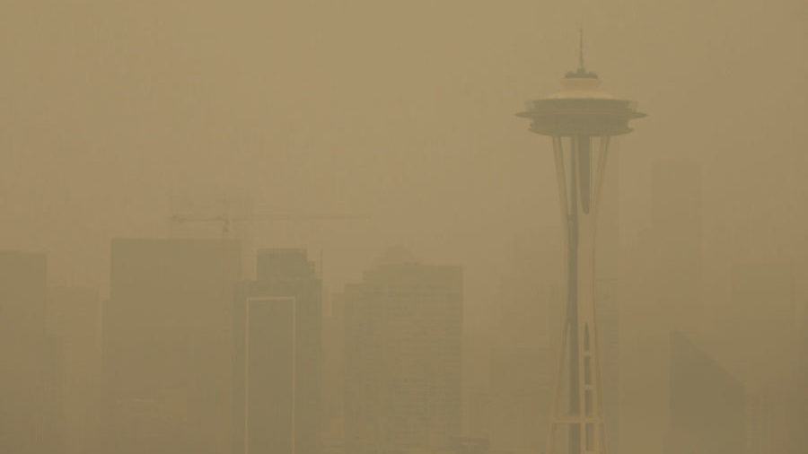

---
format:
  html:
    toc: true
    toc-location: right
    smooth-scroll: true
    code-fold: true
    embed-resources: true
editor: visual
---

:::::: columns
::: {.column width="40%"}
{fig-alt="Seattle skyline and Space Needle obscured by wildfire smoke on September 12, 2020"}
:::

::: {.column width="4%"}
:::

::: {.column width="56%"}
## SHM 377: Hazardous Materials Management

### Introduction to Hazardous Materials Management

**Lecture 01 · Fall 2026**

Yoni Rodriguez\
Engineering Technologies, Safety, and Construction\
Central Washington University\
[Yoni.Rodriguez\@cwu.edu](mailto:Yoni.Rodriguez@cwu.edu)
:::
::::::

# Introduction

- Who am I?
- What are hazardous materials?
- How do we manage hazardous materials?
- Where does data fit?
- What will we do in this course?

# Who am I?

:::::: columns
::: {.column width="44%"}
.](nasa-award.jpg){fig-alt="Yoni Rodriguez receiving the 2024 Peer Award at NASA Armstrong Flight Research Center"}
:::

::: {.column width="5%"}
:::

::: {.column width="51%"}
## Before CWU

**Environmental Health Scientist**\
NASA

## Education

**B.S. Biochemistry**\
Washington State University

**Graduate Training**\
University of Washington

## Today

**Assistant Professor**\
Central Washington University

**Research Scientist**\
University of Washington
:::
::::::

# Tell Me About You

Before we get started, I'd like to learn a little about who's in the room.

### Poll Everywhere: First-Time Setup

1. Scan the QR code below.
2. Sign in/register using your **CWU account**.
3. Complete the **Tell Me About You** survey.
4. We'll use this same response page throughout SHM 377.

{fig-alt="Poll Everywhere QR code and response link for SHM 377" width="700"}

**Today's survey:**

- What is your year in school?
- What is your major?
- Have you taken a course related to hazardous materials before?
- Have you used R, RStudio, or another programming language before?

# What Are Hazardous Materials and How Do We Manage Them?

Before we define a hazardous material, let's see what you think.

## What Counts as a Hazardous Material?

### Poll Everywhere

**Which of the following would you consider a hazardous material?**

*Select all that apply.*

- Gasoline
- Lead
- Asbestos
- Pesticides
- Lithium-ion batteries
- Smoke
- Ionizing radiation
- Non-ionizing radiation
- Heat
- Cold
- Bacteria
- Viruses

Use the same Poll Everywhere response page from the beginning of class.

{fig-alt="Poll Everywhere QR code and response link for SHM 377" width="700"}

## What Made You Choose?

Look at the class responses.

> **Why did you consider some of these hazardous materials?**

> **Why might you have hesitated on others?**

What made something seem hazardous?

- Could it make someone sick?
- Could it cause an injury?
- Could it burn or explode?
- Could it damage property?
- Could it damage the environment?
- Could someone be exposed to it?

These are all useful questions.

But there is another question we need to answer:

> **Is everything that is hazardous a hazardous material?**

# Types of Hazards

Hazards can take many forms.

:::::: columns
::: {.column width="30%"}
## Chemical

- Toxic substances
- Flammable materials
- Corrosives
- Reactive materials
- Explosives
:::

::: {.column width="5%"}
:::

::: {.column width="30%"}
## Physical

- Heat
- Cold
- Noise
- Ionizing radiation
- Non-ionizing radiation
- Ergonomic stressors
:::

::: {.column width="5%"}
:::

::: {.column width="30%"}
## Biological

- Bacteria
- Viruses
- Mold
- Vector-borne hazards
:::
::::::

<br>

All of these can cause harm.

But **not every hazard is a hazardous material**.

## Hazard ≠ Hazardous Material

A **hazard** is something with the potential to cause harm.

A **hazardous material** is a material or substance whose properties can pose a risk to:

- human health
- safety
- property
- the environment

Consider some of our Poll Everywhere examples.

**Heat** can be hazardous, but heat is not a material.

**Cold** can be hazardous, but cold is not a material.

**Noise** can damage hearing, but noise is not a material.

**Ionizing radiation** can cause harm, but radiation is energy rather than matter.

A **radioactive material**, however, contains unstable atoms that emit ionizing radiation.

> **All hazardous materials present hazards, but not all hazards are hazardous materials.**

## Where Does SHM 377 Fit?

This course focuses on **hazardous materials and their management**.

But hazardous materials do not exist in isolation.

A real-world hazardous-material problem may also involve:

- heat or cold
- noise
- radiation
- biological hazards
- environmental conditions
- worker activities
- emergency conditions

Understanding the entire situation helps us make better management decisions.

# What Is a Hazardous Material?

At a broad level, a hazardous material is a substance or material capable of causing harm to:

- human health
- safety
- property
- the environment

Hazardous materials may exist as:

- **solids**
- **liquids**
- **gases**

What makes them hazardous depends on their physical, chemical, biological, or radioactive properties.

## Hazardous Properties

Some important hazardous properties include:

- **Flammability** — ability to ignite and burn
- **Corrosivity** — ability to damage living tissue or materials
- **Toxicity** — ability to cause harmful health effects
- **Reactivity** — ability to undergo dangerous chemical reactions
- **Explosivity** — ability to rapidly release energy and pressure
- **Oxidizing potential** — ability to intensify combustion
- **Pressure** — hazards associated with compressed or liquefied gases
- **Radioactivity** — emission of ionizing radiation
- **Biological hazard** — presence of disease-causing organisms or biological agents

A material may have **more than one hazardous property**.

## Does Everyone Define "Hazardous Material" the Same Way?

Not necessarily.

Different organizations define and classify hazardous materials based on the problem they are trying to manage.

:::::: columns
::: {.column width="46%"}
### Workplace

**OSHA / Washington L&I**

How can workers be protected from hazardous chemicals and exposures?
:::

::: {.column width="8%"}
:::

::: {.column width="46%"}
### Transportation

**U.S. Department of Transportation**

Can the material pose an unreasonable risk during transportation?
:::
::::::

<br>

:::::: columns
::: {.column width="46%"}
### Environment & Waste

**EPA / Washington State Department of Ecology**

How should releases, contamination, and hazardous wastes be managed?
:::

::: {.column width="8%"}
:::

::: {.column width="46%"}
### Emergency Response

**NFPA and other emergency-response systems**

What hazards do responders need to recognize quickly?
:::
::::::

<br>

The same material may therefore be described or regulated differently depending on **where it is, how it is being used, and what is happening to it**.

## Hazard Communication Is Part of Management

Throughout SHM 377, we will encounter several systems used to communicate information about hazardous materials.

- **GHS / OSHA labels and Safety Data Sheets**
- **DOT hazard classes and placards**
- **NFPA 704 hazard identification**
- **Environmental and hazardous-waste classifications**

You will learn how to recognize and use these systems.

But hazardous-material management requires more than recognizing a symbol or memorizing a label.

# From Hazard Recognition to Hazard Management

When we encounter a hazardous-material problem, we need to ask more than:

> **What is it?**

We also need to ask:

> **What can it do?**

> **Where is it?**

> **How can it move?**

> **Who or what could be exposed?**

> **How much is present?**

> **How do we control or manage it?**

## A Framework for SHM 377

As we work through SHM 377, we will think about hazardous-material problems as a system:

```text
Hazard / Material
       ↓
Properties
       ↓
Source / Activity
       ↓
Release or Hazard Generation
       ↓
Environmental / Workplace Medium
       ↓
Transport or Transmission
       ↓
Exposure
       ↓
Health / Safety / Environmental Effects
       ↓
Measurement & Evaluation
       ↓
Controls / Management
       ↓
Regulation & Communication
```

Not every hazardous-material problem will require every step.

But this framework gives us a systematic way to understand what is happening and decide what information we need.

## Example: Smoke in the Air

Consider the photograph from the beginning of today's lecture.

:::::: columns
::: {.column width="48%"}
### What might we ask?

- What is in the smoke?
- Where did it come from?
- How did it enter the air?
- How is it moving?
- Who might be exposed?
- How much is present?
- At which concentration is it hazardous? 
:::

::: {.column width="48%"}
### Then what?

- How could we measure it?
- What do the measurements mean?
- Are concentrations changing?
- When are concentrations highest?
- What actions might reduce exposure?
:::
::::::

This is where **measurement** becomes part of hazardous-material management.

# How Do We Know What Is Happening?

Hazard recognition tells us that something **may** be dangerous.

Measurement helps us determine what is actually happening.

Measurements can help us answer questions such as:

- How much is present?
- When did concentrations increase?
- How long did elevated conditions last?
- Where are the highest concentrations?
- Are conditions improving or getting worse?
- Did a control measure make a difference?

But measurements create another challenge:

> **What do we do when we have thousands of measurements?**

# From Measurement to Data

Environmental and workplace instruments can collect measurements every:

- second
- minute
- hour
- day

A single monitoring project can quickly produce thousands of observations.

Humans are not very good at finding patterns by scrolling through thousands of spreadsheet rows.

So we need tools that help us:

```text
Question
   ↓
Data
   ↓
Check
   ↓
Describe
   ↓
Visualize
   ↓
Interpret
   ↓
Manage
```

This will become another recurring workflow in SHM 377.

# Virtual Laboratory

## Introduction to R, RStudio, and Environmental Monitoring Data

After the break, we will use a real environmental-monitoring dataset to begin answering a hazardous-material question.

Our first case:

> **What happened to ambient particle concentrations during five days of winter smoke monitoring?**