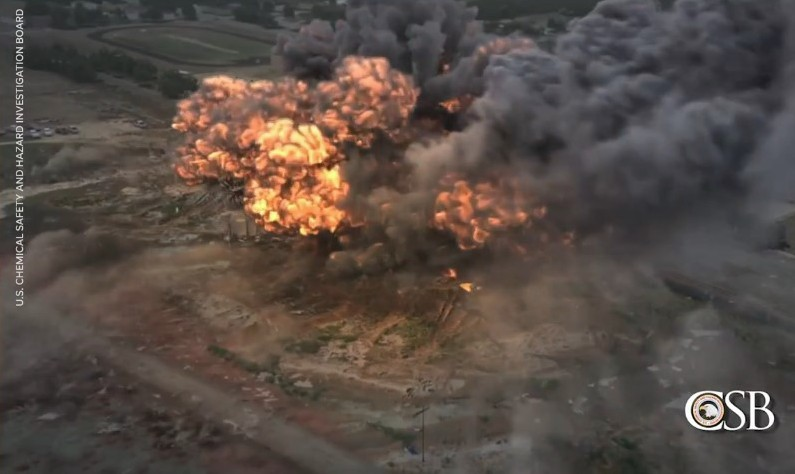
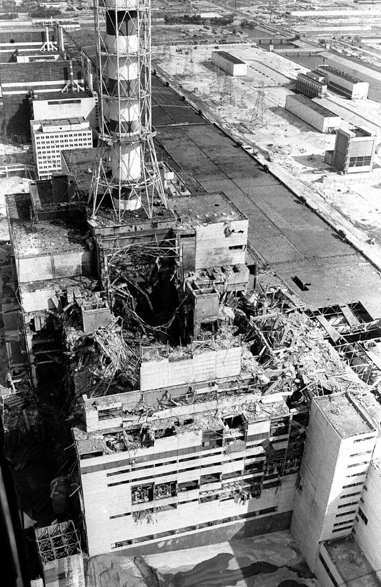
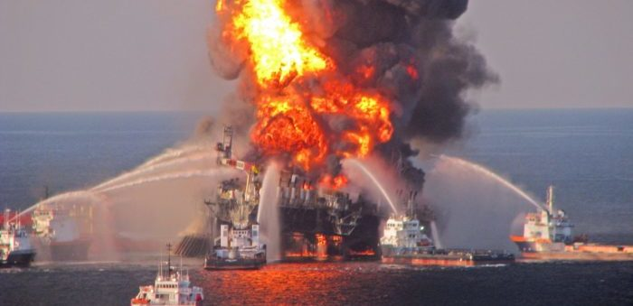
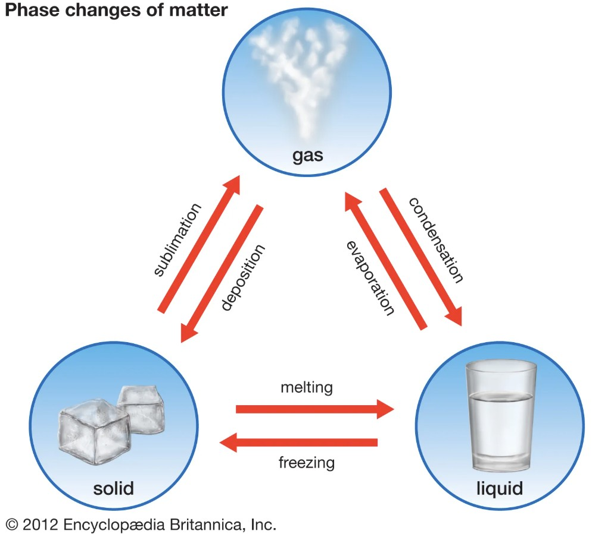
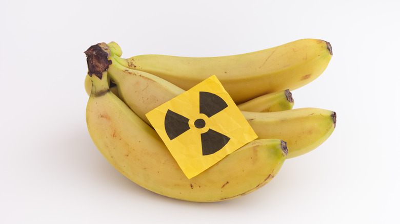
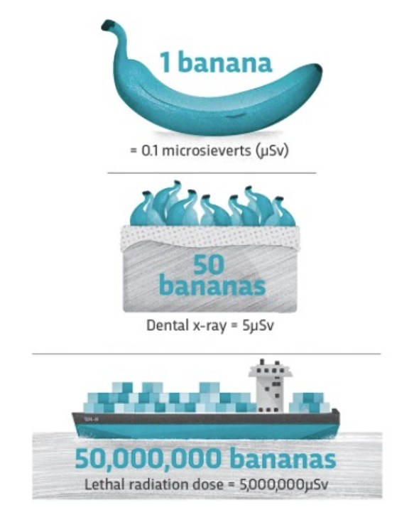
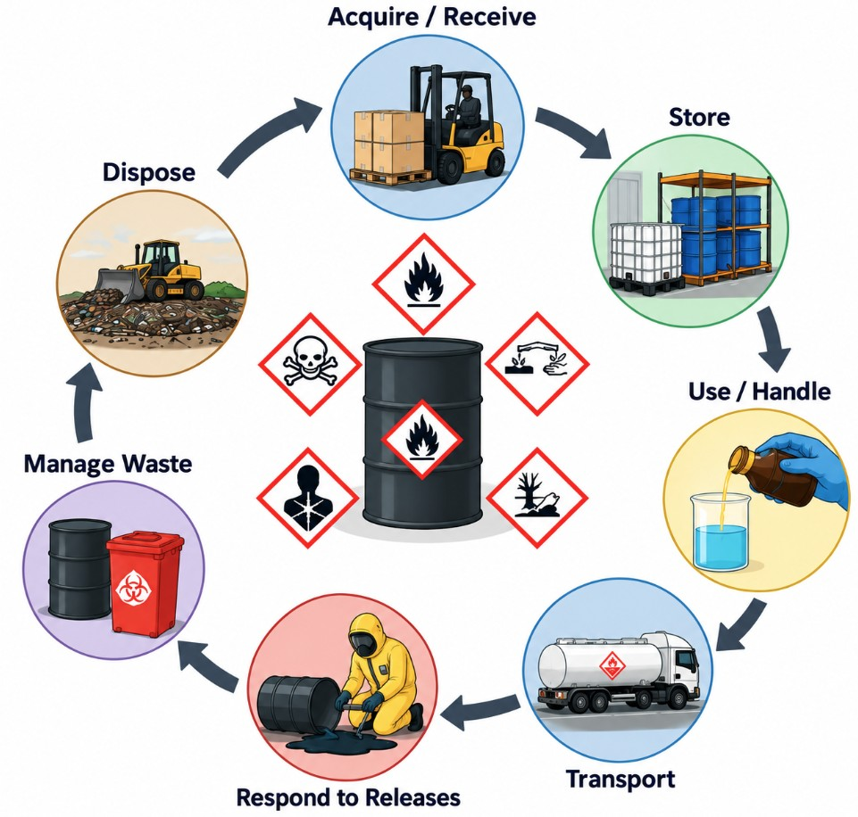

---
format:
  html:
    toc: true
    toc-location: right
    smooth-scroll: true
    code-fold: true
    embed-resources: true
editor: visual
---

```{=html}
<style>

/* =========================================================
   SHM 377 Lecture Styling
   ========================================================= */

/* ---------------------------------------------------------
   Typography
   Keep lecture text consistent throughout the document
   --------------------------------------------------------- */

body {
  color: #212529;
}

blockquote {
  color: #212529;
  font-size: inherit;
  font-style: normal;
  font-weight: normal;
}

blockquote strong {
  color: #212529;
}

.text-center {
  color: #212529;
}


/* ---------------------------------------------------------
   Types of Hazards
   Keep images aligned on larger screens
   --------------------------------------------------------- */

.hazard-list {
  min-height: 165px;
}


/* =========================================================
   Responsive Mobile Layout
   Stack ALL Quarto columns on narrow screens
   ========================================================= */

@media (max-width: 768px) {

  /* Convert every Quarto column group to a vertical layout */
  .columns {
    display: block !important;
  }

  /* Every content column becomes full width */
  .columns > .column {
    width: 100% !important;
    max-width: 100% !important;
    flex: 0 0 100% !important;
  }

  /* Remove empty spacer columns used in desktop layouts */
  .columns > .column:empty {
    display: none !important;
  }

  /* Remove desktop-only fixed heights */
  .hazard-list {
    min-height: auto;
  }

  /* Keep images within the phone viewport */
  img {
    max-width: 100%;
    height: auto;
  }

  /* Prevent long links or captions from forcing page width */
  p,
  li,
  figcaption {
    overflow-wrap: anywhere;
  }

}

</style>
```

:::::: columns
::: {.column width="40%"}
{fig-alt="View of Yosemite Valley from Wawona Road with El Capitan on the left, Half Dome near the center, Cathedral Rocks and Spires on the right, and the forested Yosemite Valley below"}
:::

::: {.column width="4%"}
:::

::: {.column width="56%"}
## SHM 377: Hazardous Materials Management

### Introduction to Hazardous Materials Management

**Lecture 01 · Fall 2026**

Yoni Rodriguez\
Engineering Technologies, Safety, and Construction\
Central Washington University\
[Yoni.Rodriguez\@cwu.edu](mailto:Yoni.Rodriguez@cwu.edu)
:::
::::::

# Introduction

- Who am I?
- What are hazardous materials?
- How do we manage hazardous materials?
- Where does data fit?
- What will we do in this course?

# Who am I?

:::::: columns
::: {.column width="44%"}
.](nasa-award.jpg){fig-alt="Yoni Rodriguez receiving the 2024 Peer Award at NASA Armstrong Flight Research Center"}
:::

::: {.column width="5%"}
:::

::: {.column width="51%"}
## Before CWU

**Environmental Health Scientist**\
NASA

## Education

**B.S. Biochemistry**\
Washington State University

**Graduate Training**\
University of Washington

## Today

**Assistant Professor**\
Central Washington University

**Research Scientist**\
University of Washington
:::
::::::

# Tell Me About You

Before we get started, I'd like to learn a little about who's in the room.

### Poll Everywhere: First-Time Setup

1.  Scan the QR code below.
2.  Sign in/register using your **CWU account**.
3.  Complete the **Tell Me About You** survey.
4.  We'll use this same response page throughout SHM 377.

::: {style="text-align:center; margin: 2rem 0;"}
{fig-alt="QR code to join the SHM 377 Poll Everywhere presentation" width="250"}

**Scan the QR code to join Poll Everywhere.**
:::

**Today's survey:**

- What is your year in school?
- What is your major?
- Have you taken a course related to hazardous materials before?
- Have you used R, RStudio, or another programming language before?

# What Are Hazardous Materials and How Do We Manage Them?

Before we define a hazardous material, let's see what you think.

## What Counts as a Hazardous Material?

### Poll Everywhere

**Which of the following would you consider a hazardous material?**

*Select all that apply.*

- Gasoline
- Lead
- Asbestos
- Pesticides
- Lithium-ion batteries
- Smoke
- Ionizing radiation
- Non-ionizing radiation
- Heat
- Cold
- Bacteria
- Viruses

Use the same Poll Everywhere response page from the beginning of class.

::: {style="text-align:center; margin: 2rem 0;"}
{fig-alt="QR code to join the SHM 377 Poll Everywhere presentation" width="250"}

**Scan the QR code to respond.**
:::

## What Made You Choose?

> **Why did you consider some of these hazardous materials?**

> **Why might you have hesitated on others?**

What made something seem hazardous?

- Could it make someone sick?
- Could it cause an injury?
- Could it burn or explode?
- Could it damage property?
- Could it damage the environment?
- Could someone be exposed to it?

These are all useful questions.

But there is another question we need to answer:

> **Is everything that is hazardous a hazardous material?**

# Types of Hazards

Hazards can take many forms.

::::::::::: columns
:::: {.column width="30%"}
## Chemical

::: hazard-list
- Toxic substances
- Flammable materials
- Corrosives
- Reactive materials
- Explosives
:::

{fig-alt="Explosion at the West Fertilizer Company in West, Texas, on April 17, 2013" width="100%"}
::::

::: {.column width="5%"}
:::

:::: {.column width="30%"}
## Physical

::: hazard-list
- Heat
- Cold
- Noise
- Ionizing radiation
- Non-ionizing radiation
- Ergonomic stressors
:::

{fig-alt="Chernobyl Nuclear Power Plant following the April 26, 1986 reactor accident" width="100%"}
::::

::: {.column width="5%"}
:::

:::: {.column width="30%"}
## Biological

::: hazard-list
- Bacteria
- Viruses
- Mold
- Vector-borne hazards
:::

{fig-alt="Health workers wearing protective equipment during an Ebola response in Rwampara, Democratic Republic of the Congo" width="100%"}
::::
:::::::::::

<br>

All of these can cause harm.

But **not every hazard is a hazardous material**.

## Hazard ≠ Hazardous Material

A **hazard** is something with the potential to cause harm.

A **hazardous material** is a material or substance whose properties can pose a risk to:

- human health
- safety
- property
- the environment

Consider some of our Poll Everywhere examples.

**Heat** can be hazardous, but heat is not a material.

**Cold** can be hazardous, but cold is not a material.

**Noise** can damage hearing, but noise is not a material.

**Ionizing radiation** can cause harm, but radiation is energy rather than matter.

A **radioactive material**, however, contains unstable atoms that emit ionizing radiation.

> **All hazardous materials present hazards, but not all hazards are hazardous materials.**

## Where Does SHM 377 Fit?

:::::: columns
::: {.column width="52%"}
This course focuses on **hazardous materials and their management**.

But hazardous-material disasters can involve several interacting factors.

### Deepwater Horizon

**Physical hazards**

- **Pressure Differential:** "The sudden, massive drop in hydrostatic pressure allowed trapped gas to expand violently as it traveled upward." [Source: EBSCO Research Starters](https://www.ebsco.com/research-starters/environmental-sciences/gulf-mexico-oil-spill)
- **Equipment Overwhelm:** "The rig's mud-gas separator was physically incapable of handling the volume and speed of the rushing blowout. It failed, raining highly flammable drilling fluids and gas directly onto the rig deck." [Source: U.S. Department of the Interior](https://www.doi.gov/ocl/hearings/112/OilSpillInvestigation_101311)

**Chemical hazards**

- **Flammable Gas:** Methane
- **Ignition Source:** "The expanding vapor cloud quickly encountered an ignition source on the rig (likely from the electrical system or engine rooms). This caused a rapid chemical combustion reaction, resulting in a massive fireball explosion at 9:49 p.m., followed by a secondary explosion moments later." [Source: U.S. Department of the Interior](https://www.doi.gov/ocl/hearings/112/OilSpillInvestigation_101311)

**Human and organizational decisions**

- Misinterpreted pressure-test results
- Failure to recognize warning signs
- Decisions that reduced safety margins
- Inadequate response to the developing well-control problem

The disaster resulted from these factors **acting together**, not from a single hazard alone.
:::

::: {.column width="4%"}
:::

::: {.column width="44%"}
{fig-alt="Deepwater Horizon offshore drilling rig engulfed in fire in the Gulf of Mexico on April 21, 2010" width="100%"}
:::
::::::

# What Is a Hazardous Material?

:::::: columns
::: {.column width="52%"}
At a broad level, a hazardous material is a substance or material capable of causing harm to:

- human health
- safety
- property
- the environment

Hazardous materials may exist as:

- **solids**
- **liquids**
- **gases**

What makes them hazardous depends on their physical, chemical, biological, or radioactive properties.
:::

::: {.column width="4%"}
:::

::: {.column width="44%"}
{fig-alt="Diagram showing solids, liquids, and gases and the phase changes between them, including melting, freezing, vaporization, condensation, sublimation, and deposition" width="100%"}
:::
::::::

## Hazardous Properties

Some important hazardous properties include:

- **Flammability** — ability to ignite and burn
- **Corrosivity** — ability to damage living tissue or materials
- **Toxicity** — ability to cause harmful health effects
- **Reactivity** — ability to undergo dangerous chemical reactions
- **Explosivity** — ability to rapidly release energy and pressure
- **Oxidizing potential** — ability to intensify combustion
- **Pressure** — hazards associated with compressed or liquefied gases
- **Radioactivity** — emission of ionizing radiation
- **Biological hazard** — presence of disease-causing organisms or biological agents

A material may have **more than one hazardous property**.

## Does the Presence of a Hazard Mean You Will Be Harmed?

Not necessarily.

Knowing that something **has a hazardous property** is only the beginning.

To understand the potential for harm, we also need to ask:

- How much are you exposed to?
- How often are you exposed?
- How long does the exposure last?
- How does it enter or interact with the body?
- What biological effect can occur at that dose?

This relationship between the amount of exposure and the resulting effect is called the **dose-response relationship**.

## "Only the Dose Makes the Poison"

:::::: columns
::: {.column width="38%"}
{fig-alt="Renaissance portrait of Paracelsus wearing a red hat and holding a book" width="85%"}
:::

::: {.column width="6%"}
:::

::: {.column width="56%"}
**Paracelsus (1494–1541)** was a Swiss physician and alchemist often called the **Father of Toxicology**.

He is associated with one of the foundational principles of toxicology:

> **"Only the dose makes the poison."**

The important question is therefore not simply:

**Is this hazardous?**

It is also:

**At what dose does it become harmful?**
:::
::::::

::: text-center
## From Hazard to Health Effect

The presence of a hazard does not necessarily mean that harm will occur.

<br>

**Hazardous Property**\
↓\
**Exposure**\
↓\
**Dose**\
↓\
**Biological Response**

<br>

The **dose** helps connect exposure to the potential health effect.
:::

Two people can encounter the same hazardous material but receive very different doses depending on the:

- concentration or intensity
- frequency of exposure
- duration of exposure
- route of exposure

## Bananas Are Radioactive

:::::: columns
::: {.column width="47%"}
Bananas naturally contain **potassium**.

A small fraction of naturally occurring potassium is the radioactive isotope **potassium-40**.

So technically:

**Bananas are radioactive.**

But does that mean you should stop eating bananas?
:::

::: {.column width="6%"}
:::

::: {.column width="47%"}
{fig-alt="Bunch of bananas with a radiation warning symbol illustrating the natural radioactivity of potassium in bananas" width="100%"}

*Photo: Stepan Popov.*
:::
::::::

## What Do You Think?

### Poll Everywhere

Before we look at the dose, make your best guess.

**1. Should You Stop Eating Bananas?**

- Yes
- No
- Not sure

**2. Approximately how many bananas would correspond to a potentially lethal radiation dose?**

- 10
- 100
- 1,000
- 100,000
- 1,000,000
- 50,000,000

::: {style="text-align:center; margin: 2rem 0;"}
{fig-alt="QR code to join the SHM 377 Poll Everywhere presentation" width="250"}

**Scan the QR code to respond.**
:::

## Radioactive ≠ Automatically Dangerous

The important question is not simply:

**Is radiation present?**

The important question is:

> **What dose does a person receive?**

A banana contains a very small amount of naturally occurring radioactive potassium-40.

Eating a banana therefore exposes you to a **very small amount of ionizing radiation**.

The presence of radioactivity alone does not tell us whether the exposure represents a meaningful health risk.

## How Much Radiation Are We Talking About?

{fig-alt="Infographic from Information is Beautiful comparing approximate radiation doses using bananas with dental X-rays, air travel, annual radiation exposure, and a very large radiation dose" width="400"}

The **banana equivalent dose** is a communication tool used to put very small radiation doses into perspective.

The point is **not** that someone could realistically eat millions of bananas.

The point is that:

> **Detectable radiation is not the same thing as a dangerous radiation dose.**

::: text-center
## Hazard, Exposure, Dose, and Response

This gives us a more complete way to think about hazardous materials:

<br>

**Hazard**\
↓\
**Exposure**\
↓\
**Dose**\
↓\
**Response**

<br>

A material can possess a **hazardous property** without every encounter with that material producing harm.

Understanding risk requires us to consider both:

**What can the hazard do?**

and

**How much exposure actually occurs?**
:::

## Does Everyone Define "Hazardous Material" the Same Way?

Not necessarily.

Different organizations define and classify hazardous materials based on the problem they are trying to manage.

:::::: columns
::: {.column width="46%"}
### Workplace

**OSHA / Washington L&I**

How can workers be protected from hazardous chemicals and exposures?
:::

::: {.column width="8%"}
:::

::: {.column width="46%"}
### Transportation

**U.S. Department of Transportation**

Can the material pose an unreasonable risk during transportation?
:::
::::::

<br>

:::::: columns
::: {.column width="46%"}
### Environment & Waste

**EPA / Washington State Department of Ecology**

How should releases, contamination, and hazardous wastes be managed?
:::

::: {.column width="8%"}
:::

::: {.column width="46%"}
### Emergency Response

**NFPA and other emergency-response systems**

What hazards do responders need to recognize quickly?
:::
::::::

<br>

The same material may therefore be described or regulated differently depending on **where it is, how it is being used, and what is happening to it**.

## Hazard Communication Is Part of Management

Throughout SHM 377, we will encounter several systems used to communicate information about hazardous materials.

- **GHS / OSHA labels and Safety Data Sheets**
- **DOT hazard classes and placards**
- **NFPA 704 hazard identification**
- **Environmental and hazardous-waste classifications**

You will learn how to recognize and use these systems.

But hazardous-material management requires more than recognizing a symbol or memorizing a label.

## Hazardous Materials Throughout Their Life Cycle

::::::: columns
:::: {.column width="52%"}
Hazardous-material management does not occur at only one point.

A hazardous material may need to be managed throughout its life cycle:

::: text-center
Acquire / Receive\
↓\
Store\
↓\
Use / Handle\
↓\
Transport\
↓\
Respond to Releases\
↓\
Manage Waste\
↓\
Dispose
:::

Different hazards, exposures, regulations, and management decisions may become important at different stages.

> **Hazardous-material management means thinking about the material before, during, and after its use.**
::::

::: {.column width="4%"}
:::

::: {.column width="44%"}
{fig-alt="Circular hazardous materials life cycle infographic showing Acquire or Receive, Store, Use or Handle, Transport, Respond to Releases, Manage Waste, and Dispose" width="100%"}
:::
:::::::

::: text-center
# From Hazard Recognition to Hazard Management

When we encounter a hazardous-material problem, we need to ask more than:

> **What is it?**

We also need to ask:

> **What can it do?**

> **Where is it?**

> **How can it move?**

> **Who or what could be exposed?**

> **How much is present?**

> **How do we control or manage it?**

## A Framework for SHM 377

As we work through SHM 377, we will think about hazardous-material problems as a system:

<br>

**Hazard / Material**\
↓\
**Properties**\
↓\
**Source / Activity**\
↓\
**Release or Hazard Generation**\
↓\
**Environmental / Workplace Medium**\
↓\
**Transport or Transmission**\
↓\
**Exposure**\
↓\
**Dose**\
↓\
**Health / Safety / Environmental Effects**\
↓\
**Measurement & Evaluation**\
↓\
**Controls / Management**\
↓\
**Regulation & Communication**

<br>

Not every hazardous-material problem will require every step.

But this framework gives us a systematic way to understand what is happening and decide what information we need.
:::

------------------------------------------------------------------------

### Copyright & Use

**SHM 377: Hazardous Materials Management**\
© 2026 Yoni Rodriguez

Except where otherwise noted, original course materials are licensed under the Creative Commons Attribution-NonCommercial 4.0 International License (CC BY-NC 4.0).

Third-party materials remain subject to their respective copyright and licensing terms.