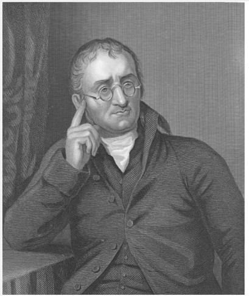
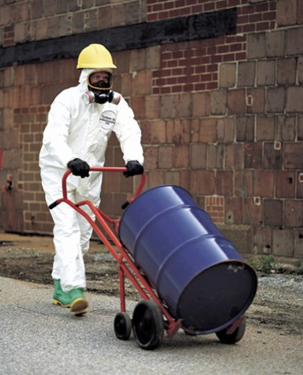
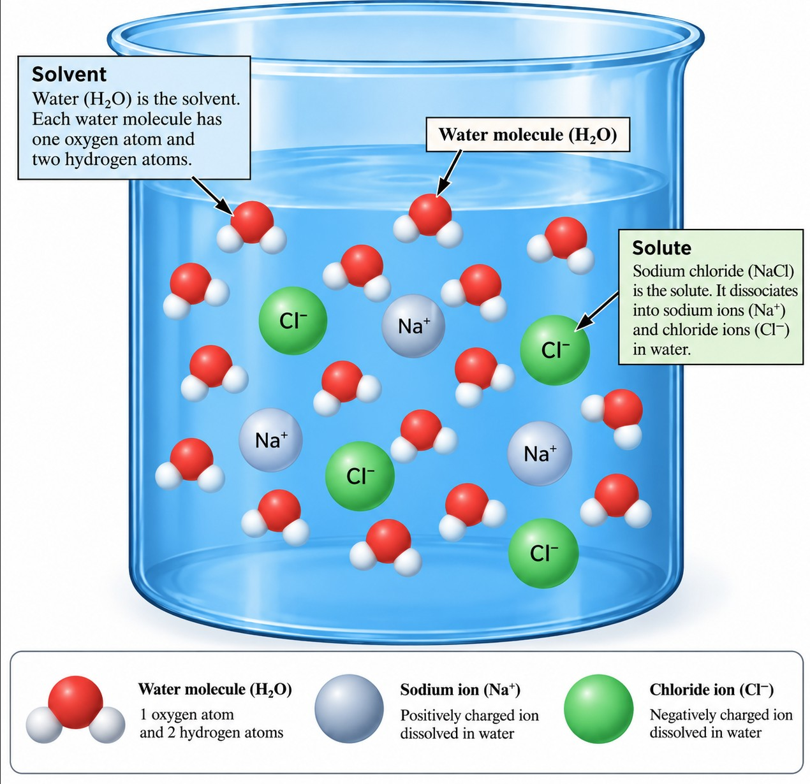

---
format:
  html:
    toc: true
    toc-location: right
    smooth-scroll: true
    code-fold: true
    embed-resources: true
  pdf:
    toc: true
    documentclass: scrartcl
    geometry:
      - margin=0.75in
editor: visual
---

```{=html}
<style>
/* =========================================================
   SHM 377 Lecture Styling
   ========================================================= */

body { 
  color: #212529; 
}

blockquote {
  color: #212529;
  font-size: inherit;
  font-style: normal;
  font-weight: normal;
}

blockquote strong { 
  color: #212529; 
}

.text-center { 
  color: #212529; 
}

.poll-layout { 
  align-items: center; 
}

.poll-qr { 
  text-align: center; 
}

/* =========================================================
   Lecture Cover
   ========================================================= */

.cover-image img {
  width: 100%;
  height: 300px;
  object-fit: cover;
  object-position: center;
}

.cover-image p {
  margin-bottom: 0;
}

/* =========================================================
   Mobile
   ========================================================= */

@media (max-width: 768px) {
  .columns { 
    display: block !important; 
  }

  .columns > .column {
    width: 100% !important;
    max-width: 100% !important;
    flex: 0 0 100% !important;
  }

  .columns > .column:empty { 
    display: none !important; 
  }

  .poll-layout { 
    display: block !important; 
  }

  .poll-layout > .column {
    width: 100% !important;
    max-width: 100% !important;
    flex: 0 0 100% !important;
  }

  img { 
    max-width: 100%; 
    height: auto; 
  }

  .cover-image img {
    height: auto;
  }

  p, li, figcaption { 
    overflow-wrap: anywhere; 
  }
}
</style>
```

::::::: {.columns style="align-items: flex-start;"}
:::: {.column width="46%"}
::: cover-image
{fig-alt="Milky Way stretching across a star-filled night sky above sand dunes, with an orange glow along the horizon"}
:::
::::

::: {.column width="4%"}
:::

::: {.column width="50%"}
## SHM 377: Hazardous Materials Management

### Chemistry of Hazardous Materials: Matter

**Lecture 02 · Fall 2026**

Yoni Rodriguez\
Engineering Technologies, Safety, and Construction\
Central Washington University\
[Yoni.Rodriguez\@cwu.edu](mailto:Yoni.Rodriguez@cwu.edu)
:::
:::::::

------------------------------------------------------------------------

## John Dalton: Thinking Beyond What We Can See

:::::::: columns
::::: {.column width="62%"}
This is the approach we are going to borrow from **John Dalton**.

In the early nineteenth century, Dalton did not have an instrument that allowed him to look at an individual atom. Instead, he studied **observable and measurable patterns in matter**, including the proportions in which elements combined, and used those patterns to develop an atomic model that could explain chemical behavior.

Dalton's model was not the final modern description of the atom. Later evidence refined it.

But the reasoning behind his work is extremely useful for us:

::: callout-note
## Dalton's Approach

**Dalton used evidence from what he could observe to reason about something he could not directly see.**

That is the mindset we are adopting in SHM 377.
:::

::: callout-note
## One Scientist, Several Contributions

John Dalton's name appears throughout chemistry because of several important contributions:

- **Atomic theory:** Dalton used experimental evidence to argue that matter consists of atoms.
- **Dalton's Law of Partial Pressures:** the total pressure of a mixture of gases is the sum of the partial pressures contributed by the individual gases.
- **Dalton (Da):** a unit of mass used at the atomic and molecular scale was named in his honor.

For this lecture, his most important contribution is the way his atomic theory helped scientists connect **observable patterns in matter** with structures too small to see directly.

We will return to **Dalton's Law of Partial Pressures** later when we examine gases and hazardous atmospheres.
:::
:::::

::: {.column width="4%"}
:::

::: {.column width="34%"}
{fig-alt="Historical black-and-white portrait of John Dalton seated, wearing round spectacles and a dark coat, with one hand raised near his face" width="100%"}
:::
::::::::

## Thinking Like a Chemist in Hazardous Materials Management

A hazardous materials professional cannot directly see everything that determines how a material will behave.

For example, we may not be able to directly see:

- why a liquid is entering the air
- what is happening when two chemicals are mixed
- why one material reacts with another
- how very small particles move through the air
- what is happening inside a material as it is heated

But we can observe and measure evidence of these processes.

We can examine:

- whether the material is a solid, liquid, or gas
- temperature and pressure
- how easily a material flows or spreads
- the amount of a substance present
- instrument readings
- changes in a container or material
- patterns in how substances behave

Then we can use chemistry to develop an explanation and make a prediction.

::: callout-note
**Thinking Like a Chemist**

Observe → Explain → Predict → Decide

We use evidence and chemical principles to understand how materials behave and make informed hazardous materials management decisions.
:::

This is what it means for us to **think like chemists**.

We are going to begin with materials and behaviors we can observe. Then, step by step, we will work toward the smaller structures and interactions that help explain why those materials behave the way they do.

## The HazMat Questions

:::::: columns
::: {.column width="58%"}
When a new chemical arrives at a workplace, we may need to determine:

- What is the material made of?
- What properties make it hazardous?
- What might happen if it is heated, spilled, mixed, or released?
- Can it enter the air?
- Can it react with another material?
- What happens if it enters the human body?
- What information do we need before deciding how to store, handle, or control it?
:::

::: {.column width="4%"}
:::

::: {.column width="38%"}
{fig-alt="Worker wearing a protective suit, gloves, respiratory protection, and a hard hat while moving a blue chemical drum with a drum cart" width="100%"}
:::
::::::

::: callout-important
## Chemistry Gives Us Evidence

Chemistry gives us a way to think through hazardous materials problems based on the behavior of matter rather than assumption.
:::

This is why chemistry appears in SHM 377. We will revisit chemistry when it helps us understand or solve a hazardous materials problem.

::: callout-note
## The Question for Today

**Why do different materials behave differently?**

To answer that question, we are going to do something similar to what Dalton did: begin with the material we can observe, then reason our way toward structures and interactions we cannot see directly.

We will move from the scale of drums, tanks, bags, and cylinders down to the smallest building blocks of matter. Then we will build our way back up to the hazardous materials decisions we need to make.
:::

------------------------------------------------------------------------

# 2. Matter

Before we can understand why hazardous materials behave differently, we need to establish what we mean by **matter**.

**Matter is anything that has mass and occupies space.**

The materials we encounter in hazardous materials management are all forms of matter. They may be stored in drums, cylinders, tanks, bags, bottles, process lines, or other containers.

Matter commonly exists as:

- solids
- liquids
- gases

We will return to these physical states later in this lecture and examine each of them in much greater detail throughout the next several lectures.

But physical state is only one way to describe matter.

## How Can Matter Be Classified?

One useful distinction is whether the material is a **pure substance** or a **mixture**.

### Pure Substances

A **pure substance** has a defined chemical composition.

Pure substances are of two types: **elements** and **compounds**.

#### Elements

An **element** is a substance that cannot be broken down into simpler substances by a chemical reaction.

Each element is made of one type of atom.

An **atom** is the smallest unit of an element that has the chemical properties of that element.

For example:

- a hydrogen atom has the chemical properties of the element hydrogen
- an oxygen atom has the chemical properties of the element oxygen
- an aluminum atom has the chemical properties of the element aluminum

Examples of elements include:

- oxygen
- chlorine
- aluminum
- mercury
- uranium

#### Compounds

A **compound** is an electrically neutral substance that consists of two or more different elements, with their atoms present in a definite ratio.

For example, water is a compound made from the elements hydrogen and oxygen.

The chemical formula for water is:

**H₂O**

This tells us that water contains two hydrogen atoms for every one oxygen atom.

Other examples of compounds include:

- carbon dioxide (CO₂) (*cellular respiration*)
- sodium chloride (NaCl) (*seawater*)
- sulfur dioxide (SO₂) (*volcanic eruptions, hots springs, decay of organic matter*)

The elements in a compound are not simply mixed together. Their atoms are **chemically bonded** to one another in a specific arrangement.

Because the atoms are chemically joined, a compound can have **physical** and **chemical** properties that are very different from the elements that make it up.

We will examine **atoms** and **chemical bonding** in greater detail later in this lecture.

### Mixtures

A **mixture** contains two or more substances that are <u>*physically*</u> combined rather than <u>*chemically*</u> joined into a single substance with a fixed composition.

Because the substances are physically combined, the individual substances retain their chemical identities and many of their properties.

Unlike a compound, the composition of a mixture can vary.

For example:

For example:

- **air** is a mixture of gases
  - nitrogen (N<sub>2</sub>): approximately 78.08%
  - oxygen (O<sub>2</sub>): approximately 20.95%
  - argon (Ar): approximately 0.93%
  - carbon dioxide (CO<sub>2</sub>): approximately 0.04%
  - *These percentages describe dry air. Water vapor varies in the atmosphere.*
- **seawater** is a mixture of water, dissolved salts, and other substances
  - water (H<sub>2</sub>O) is the major component
  - sodium (Na<sup>+</sup>)
  - chloride (Cl<sup>−</sup>)
  - magnesium (Mg<sup>2+</sup>)
  - sulfate (SO<sub>4</sub><sup>2−</sup>)
  - calcium (Ca<sup>2+</sup>)
  - potassium (K<sup>+</sup>)
- **granite** is a mixture of different minerals
  - quartz (SiO<sub>2</sub>): silicon and oxygen
  - feldspar: primarily silicon, oxygen, aluminum, and potassium, sodium, and/or calcium
  - mica: a group of minerals that commonly includes muscovite and biotite
  - the proportions of these minerals can vary from one piece of granite to another
- **brass** is a mixture of metals
  - copper (Cu)
  - zinc (Zn)
  - the proportions of copper and zinc can vary depending on the type of brass

Mixtures can be classified as either **homogeneous** or **heterogeneous**.

#### Homogeneous Mixtures

In a **homogeneous mixture**, the composition is uniform throughout the material.

A homogeneous mixture is often called a <u>*solution*</u>.

For example, consider salt dissolved completely in water.

If we collected a small sample from one portion of the solution and another sample from a different portion, we would expect them to have the same general composition.

Other examples include:

- air
- filtered seawater
- saltwater
- some metal alloys, such as brass (copper + zinc)
- *cough syrup* (every spoonful should contain approximately the same concentration of ingredients)

A solution does not have to be a liquid.

Air is a homogeneous mixture of gases, and some solid alloys can also be treated as homogeneous mixtures.

In a solution, the substance present in the greatest amount is typically called the **solvent**. The substance or substances dissolved in it are called **solutes**.

For saltwater:

**water = solvent**

**salt = solute**

{fig-alt="Diagram of a saltwater solution showing water molecules throughout the liquid and dissolved sodium and chloride ions. Water is identified as the solvent, sodium chloride as the solute, and an individual water molecule is labeled H2O." width="65%" fig-align="center"}

#### Molecules and Ions

The saltwater example introduces two chemical terms that we will use throughout this course: **molecule** and **ion**.

A **molecule** is made up of two or more atoms that are bound together in a discrete arrangement.

Water is made of water molecules.

Each water molecule, H₂O, contains:

- two hydrogen atoms
- one oxygen atom

Those atoms are chemically bonded together in a specific arrangement to form a water molecule.

An **ion** is an atom or group of bonded atoms that has a positive or negative electrical charge.

In our saltwater example:

- **Na⁺** is a positively charged sodium ion
- **Cl⁻** is a negatively charged chloride ion

When sodium chloride dissolves in water, sodium and chloride are dispersed throughout the water as ions.

::: callout-note
## Build the Vocabulary

**Atom:** the smallest unit of an element that has the chemical properties of that element.

**Molecule:** two or more atoms bound together in a discrete arrangement.

**Ion:** an atom or group of bonded atoms with a positive or negative electrical charge.

**Solvent:** the substance in a solution that dissolves the other substance or substances.

**Solute:** a substance dissolved in a solvent.

We will return to atoms, electrical charge, ions, and chemical bonding as we continue through the course.
:::

#### Heterogeneous Mixtures

:::::: {.columns style="align-items: flex-start;"}
::: {.column width="55%"}
In a **heterogeneous mixture**, the composition is not uniform throughout the material.

Different portions of the mixture may contain different amounts of its components.

**Granite** is a good example. Granite contains different minerals, and the proportions of those minerals can vary from one portion of the rock to another.

##### A Practical Example: Climbing Sugarloaf Mountain

I have encountered this idea firsthand while **slab climbing Sugarloaf Mountain (Pão de Açúcar) in Rio de Janeiro, Brazil**.

From a distance, the enormous rock face may appear to be one continuous material. But Sugarloaf actually contains **several different types of rock**, and those rocks themselves contain different minerals.

As we move from the scale of a mountain to the scale of a rock, and then to the minerals within the rock, we begin to see something important:

**A material that appears uniform from a distance may contain different components when we examine it more closely.**

Other examples of heterogeneous mixtures include:

- soil
- sand mixed with salt
- a liquid containing suspended solid particles (blood)

For hazardous materials management, this distinction can become important.

If solid particles are suspended in a liquid, for example, the amount of solid present in one portion of the container may differ from another if the particles settle over time.
:::

::: {.column width="3%"}
:::

::: {.column width="42%"}
{fig-alt="Rock climber ascending a steep exposed rock face on Sugarloaf Mountain in Rio de Janeiro, Brazil" width="100%"}

{fig-alt="Christ the Redeemer statue standing on top of Corcovado Mountain above Rio de Janeiro, Brazil" width="100%"}
:::
::::::

## A Map of Matter

The relationship between these categories can be organized like this:

{fig-alt="Flow chart showing matter as solid, liquid, or gas and classifying matter into mixtures and substances. Mixtures may be homogeneous or heterogeneous and are connected to substances by physical techniques. Substances branch into compounds and elements, with compounds connected to elements by chemical techniques." width="75%" fig-align="center"}

*Source: Peter Atkins et al., Chemical Principles.*

## Physical Separation or Chemical Change?

There is an important idea contained in this diagram.

A **mixture** contains substances that are physically combined. Because the substances retain their chemical identities, we can often separate them using **physical techniques** without changing what those substances are.

Examples of physical separation techniques include:

- filtration
- settling and decanting
- evaporation
- distillation
- chromatography

Consider saltwater.

Saltwater is a mixture of salt and water. If the water is evaporated, the water changes physical state and the salt can remain behind.

We have separated components of the mixture, but we have not changed the chemical identity of the salt or the water.

A **compound** is different.

The elements in a compound are chemically bonded together. Separating a compound into its constituent elements therefore requires a **chemical change** rather than simply a physical separation.

Consider water:

**H₂O**

Hydrogen and oxygen are chemically bonded within water molecules. We cannot separate water into hydrogen and oxygen using filtration, settling, or another physical separation technique.

Doing so requires a chemical process that changes the identity of the original substance.

::: callout-note
## A Useful Distinction

**Mixture → physical separation**

The substances retain their chemical identities.

**Compound → chemical change**

Chemical bonds must be changed to produce different substances.

This distinction helps us understand the difference between substances that are simply present together and elements that are chemically bonded together.
:::

::: callout-note
## Think Like a Chemist

When you encounter a material, begin by asking:

**What am I actually dealing with?**

Is it an element, a compound, or a mixture?

If it is a mixture:

- Is its composition uniform throughout?
- What substances are present?
- Could those substances be separated physically?

If it is a compound:

- What elements make up the compound?
- How are those atoms chemically joined?
- What would have to change chemically to produce a different substance?

These questions help determine what information we need before we can predict how the material will behave.
:::

## Properties of Matter

Knowing whether something is an element, compound, or mixture tells us **what kind of matter we are dealing with**.

Our next question is:

> **What properties does that material have?**

The properties of matter give us evidence about how a material may behave and how it may interact with its surroundings.

### Physical Properties

A **physical property** can be observed or measured without changing the chemical identity of the substance.

Examples include:

- physical state
- color
- density
- melting point
- boiling point
- hardness
- viscosity

Consider water.

Liquid water can freeze and become solid ice. Its physical state has changed, but its chemical identity has not.

It is still water.

The molecules are still H₂O.

This is a **physical change** because the identity of the substance remains the same.

### Chemical Properties

A **chemical property** describes the ability of a substance to undergo a chemical change and form one or more different substances.

For example, hydrogen can react with oxygen to form water.

The starting substances are:

**hydrogen + oxygen**

After the chemical reaction, a different substance has formed:

**water**

The chemical identities of the starting materials have changed.

::: callout-note
## Physical or Chemical?

**Physical property:** What can we observe or measure without changing the identity of the substance?

**Chemical property:** How can the substance react or change into a different substance?
:::

## Why Properties Matter in Hazardous Materials Management

Both physical and chemical properties give us information we can use to predict hazardous material behavior.

### Physical properties can help us ask:

- Is the material a solid, liquid, or gas?
- How dense is the material?
- How easily might a liquid flow and spread?
- How easily might a liquid evaporate?
- At what temperature might a solid melt?
- At what temperature might a liquid boil?

### Chemical properties can help us ask:

- Is the material flammable?
- Can it react with water?
- Can it react with another chemical?
- Can it oxidize?
- Can it decompose?
- Could a reaction release heat?
- Could a reaction produce a hazardous substance?

::: callout-note
## Think Like a Chemist

**Physical properties help us predict how a material may behave.**

**Chemical properties help us predict how a material may react.**

Both give us evidence that can help us make hazardous materials management decisions.
:::

## Why Does This Matter in Hazardous Materials Management?

A product may have **one name on the container**, but the material inside may contain several different substances.

It could contain:

- a solvent
- water
- dissolved substances
- suspended particles
- additives
- contaminants
- several hazardous ingredients

Knowing the product name is therefore only the beginning.

A hazardous materials professional may need to determine:

- what substances are present
- whether the material is a pure substance or a mixture
- whether a mixture is homogeneous or heterogeneous
- whether the composition is uniform throughout the material
- whether the components can be physically separated
- what physical and chemical properties influence how the material behaves

::: callout-important
## The Hazard May Depend on What Is Actually Present

Before we can predict what matter will do, we first need to understand **what that matter is made of and what properties it has**.

A product name alone may not tell us everything we need to know.
:::

------------------------------------------------------------------------

# Key Takeaways

::: callout-note
## What Should You Remember?

1.  **Matter is anything that has mass and occupies space.**

2.  Matter can be classified as a **pure substance** or a **mixture**.

3.  Pure substances can be classified as **elements** or **compounds**.

4.  Mixtures can be **homogeneous** or **heterogeneous**.

    - A homogeneous mixture has a uniform composition throughout.
    - A heterogeneous mixture does not have a uniform composition throughout.

5.  A **solution** is a homogeneous mixture containing a solvent and one or more solutes.

6.  Mixtures can often be separated using **physical techniques** because the substances retain their chemical identities.

7.  Separating a compound into different substances requires a **chemical change**.

8.  **Physical properties** can be observed or measured without changing the chemical identity of a substance.

9.  **Chemical properties** describe how a substance can undergo chemical change and form different substances.
:::

The goal is not simply to memorize these classifications.

We use them to begin answering a more important hazardous materials question:

**What am I actually dealing with, and what does that tell me about how the material may behave?**

------------------------------------------------------------------------

# Key Terms

| Term | Meaning |
|------------------------------------|------------------------------------|
| **Atom** | The smallest unit of an element that has the chemical properties of that element. |
| **Matter** | Anything that has mass and occupies space. |
| **Pure substance** | Matter with a defined chemical composition. |
| **Element** | A substance that cannot be broken down into simpler substances by a chemical reaction. |
| **Compound** | An electrically neutral substance consisting of two or more different elements whose atoms are present in a definite ratio. |
| **Mixture** | Two or more substances physically combined while retaining their chemical identities. |
| **Homogeneous mixture** | A mixture with a uniform composition throughout. |
| **Heterogeneous mixture** | A mixture that does not have a uniform composition throughout. |
| **Solution** | A homogeneous mixture in which one or more substances are dissolved in another substance. |
| **Solvent** | The substance in a solution that dissolves the other substance or substances. |
| **Solute** | A substance dissolved in a solvent. |
| **Molecule** | Two or more atoms bound together in a discrete arrangement. |
| **Ion** | An atom or group of bonded atoms with a positive or negative electrical charge. |
| **Physical separation** | A process that separates substances without changing their chemical identities. |
| **Physical change** | A change in form or physical state that does not change the chemical identity of a substance. |
| **Chemical change** | A process that produces one or more substances with different chemical identities. |
| **Physical property** | A property that can be observed or measured without changing the chemical identity of a substance. |
| **Chemical property** | A property describing the ability of a substance to undergo chemical change. |

### Copyright & Use

**SHM 377: Hazardous Materials Management**\
© 2026 Yoni Rodriguez

Except where otherwise noted, original course materials are licensed under the Creative Commons Attribution-NonCommercial 4.0 International License (CC BY-NC 4.0).

Third-party materials remain subject to their respective copyright and licensing terms.
